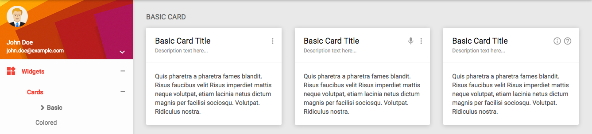
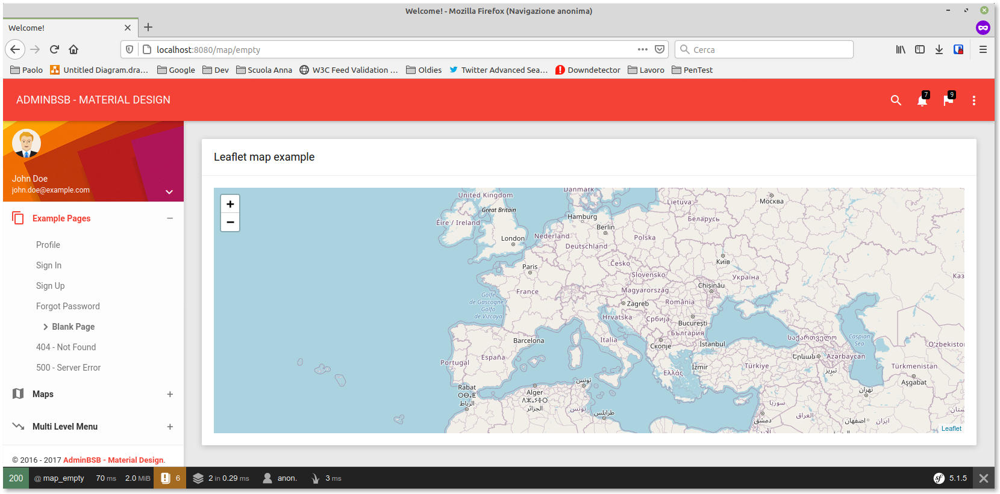

****
A questo punto del corso abbiamo un database popolato: vediamo come muoverci nei dati usando una ((GUI)) e i ((Controller)) di Symfony.
****

Il template che usiamo è bello, ma la sezione *Maps* deficita un po': ci piacerebbe usare una mappa senza dover pagare licenze d'uso, ma sia Google che Yandex hanno API utilizzabili solo dietro registrazione (e non è escluso che diventino a pagamento nei prossimi tempi).

 

Ho scelto perciò di usare la libreria *((Leaflet))*, che oltre ad avere ottime performance e supportare diversi provider, è open source e non richiede pagamenti di alcun tipo: un plauso al suo autore, http://agafonkin.com/en[Vladimir Agafonkin]. +
Dalla pagina <https://leafletjs.com/download.html> scarichiamo l'ultima versione stabile della libreria (un file zip), scompattiamolo e spostiamo la directory *leaflet/* dentro *public/plugins/* in modo che la libreria e il suo foglio di stile possano essere _serviti_ dal container *_((nginx))_*.

== Nuova pagina

Aggiungiamo ora una pagina HTML che userà la libreria _Leaflet_ per mostrare
una mappa geografica. Anzitutto creiamo l'azione corrispondente nel ((Controller)) e associamole una ((Route)), ad es. */map/empty*, aggiungendo queste righe a *src/Controller/SuperController.php*:

[source,php]
.Nuova azione in src/Controller/SuperController.php
----
/**
 * @Route("/map/empty", name="map_empty") <1>
 */
public function mapEmpty()
{
  return $this->render('map_empty.html.twig'); <2>
}
----
<1> La rotta */map/empty* è totalmente arbitraria, potete cambiarla come preferite.
<2> _Nota_: questo template non esiste ancora.

[#cards]
=== Usiamo le _Card_

Nel template _(({template_name}))_ ci sono tre pagine della sezione *Widgets* dedicate ai componenti chiamati _Cards_: sono elementi grafici adatti a contenere testo e/o altro, in modo da separarlo visivamente dal resto. Per mostrare la nostra mappa useremo una di queste *Card*.

.Le card di Bootstrap

[#mappa_vuota_markup]
=== Markup

Creiamo il file *templates/map_empty.html.twig* con questo contenuto:

[source,html]
.templates/map_empty.html.twig
----



    <link rel="stylesheet" href="/plugins/leaflet/leaflet.css" /> <1>



  

    

      

        

          <h2>Leaflet map example</h2>
        

        

          

 <2>
        

      

    

  




   <3>
  

----

<1> Foglio di stile di Leaflet.
<2> Questo tag farà da contenitore per la mappa.
<3> Libreria Leaflet.
<4> *Dopo* aver incluso *leaflet.js*, la libreria Leaflet è accessibile mediante la variabile globale *L*. +
Per creare un'istanza di una mappa Leaflet, va chiamata la funzione *L.map()* che richiede due argomenti: +

. l'id dell'elemento contenitore - la mappa verrà mostrata all'interno di questo elemento;
. un _object literal_ (o una variabile che punta a un oggetto), contenente le opzioni di creazione della mappa.

<5> Il _Tile layer_ serve a Leaflet per caricare il contenuto della mappa. In questo caso usiamo come provider ((OpenStreetMap)), lo stesso da cui vengono i punti di interesse che abbiamo scaricato <<c30-comandi#importazione-massiva,qualche lezione fa>>.

Se ora visitiamo questa pagina con un browser, dovremmo vedere qualcosa del genere.

.Esempio di mappa Leaflet

<<<