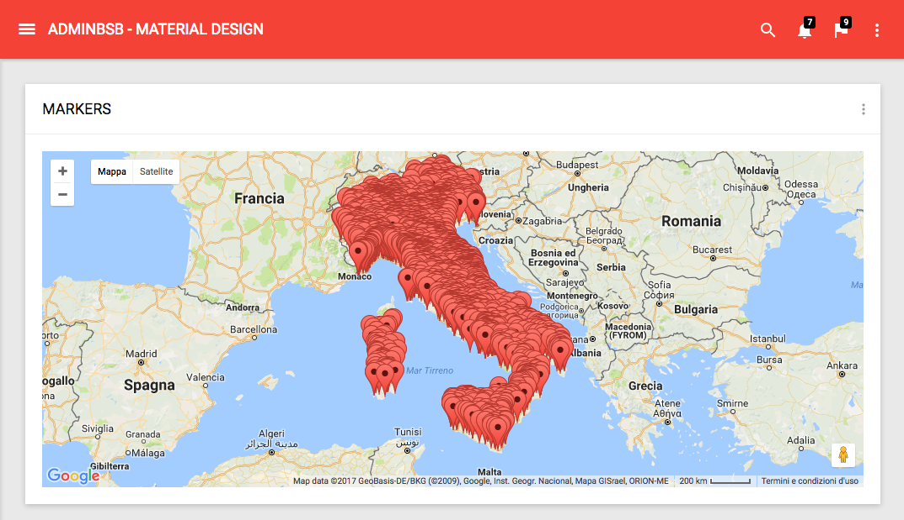
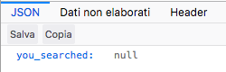
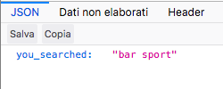
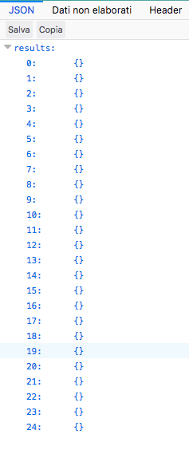
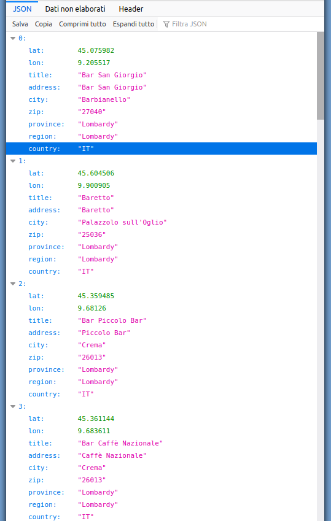

== Ricerca sulla mappa

[cols="8,2",frame=none,grid=none]
|===

a|Ora che abbiamo una mappa funzionante, vogliamo visualizzare _alcuni_ dei nostri *POI* usando segnalini o _((marker))_ ; meglio posizionarne solo *_alcuni_* e non tutti perché quando la mappa si affolla, può diventare inutilizzabile anche su PC molto performanti. 
>a|.Aspetto di un Marker in Leaflet. +

|===

.Troppi marker ravvicinati peggiorano l'esperienza d'uso del nostro sito.

Mostreremo inizialmente la mappa _vuota_, senza segnalini; quando l'utente scriverà _qualcosa_ nel box di ricerca e premerà il pulsante _Search_, la pagina effettuerà una chiamata <<AJAX>> per ricercare i *POI* corrispondenti alla stringa immessa; se la chiamata restituirà uno o più *POI*, questi verranno visualizzati sulla mappa sotto forma di segnalini (_marker_). +
In quest'ultima frase c'è un bel po' di carne al fuoco:

- *((AJAX))*: chiameremo via Javascript un URL del nostro sito Symfony, che dovrà restituire i dati ricercati; questo URL corrisponderà ad un'azione che effettua una ricerca nel db mediante una nuova funzione di *((PoiRepository))*;
- useremo *Javascript* per _ascoltare_ e gestire l'input dell'utente nel campo di ricerca (non faremo ricaricare la pagina principale);
- per gestire i *Marker* useremo alcune funzioni Javascript della libreria *Leaflet*.

=== AJAX

Cominciamo programmando la parte che si svolgerà _dietro le quinte_: creiamo  l'azione che chiameremo tramite AJAX, che non restituirà una pagina HTML ma _dati_ in formato ((JSON)). +
I dati così ottenuti dovranno essere letti e interpretati dal codice Javascript della pagina chiamante, quindi questa azione è funzionalmente diversa da quelle scritte finora che generavano _pagine_ ((HTML)), che invece vengono parserizzate direttamente dal browser. +
Nello spirito di Symfony, basato sulla separazione dei ruoli, può essere utile differenziare le azioni legate a _pagine_ HTML dalle azioni che restituiscono _dati_, creando un nuovo ((Controller)) con il seguente comando.

[#apicontroller]
[source,bash]
----
php bin/console make:controller ApiController
----

TIP: *((API))* è l'acronimo di Application Program Interface, e il nome _ApiController_ serve a ricordarci che questo *non* è un Controller destinato a generare pagine HTML.

Ora modifichiamo il file che Symfony ha creato, *src/Controller/ApiController.php*, commentando o cancellando il metodo *index()* e aggiungendo un metodo in cui leggeremo il parametro *q* della ((query string)) e lo restituiremo così com'è, restituendo una risposta in formato JSON, cioè una *JsonResponse*. +
Per leggere i parametri inviati in query string si può usare l'oggetto *Request* che possiamo far _iniettare_ da Symfony aggiungendolo come argomento, e che contiene tutti i dettagli della richiesta HTTP ricevuta dal server.

[source,php]
.src/Controller/ApiController.php
----
<?php

namespace App\Controller;

use App\Entity\Poi;
use Symfony\Bundle\FrameworkBundle\Controller\AbstractController;
use Symfony\Component\HttpFoundation\JsonResponse;
use Symfony\Component\HttpFoundation\Request;
use Symfony\Component\Routing\Annotation\Route;

/**
 * @Route("/api/v1/")
 */
class ApiController extends AbstractController
{
    /**
     * @Route("poi/search", name="api_poi_search")
     * @param Request $request
     * @return JsonResponse
     */
    public function poiSearch(Request $request)
    {
        $results = $this->getDoctrine()->getRepository(Poi::class)->search($request->get('q'));
        return new JsonResponse($results);
    }
}
----

NOTE: In assenza del parametro `q`, il metodo *$request->get('q')* restituisce NULL *senza causare errori*.

Salviamo il file e visitiamo la pagina <http://localhost:8080/api/v1/poi/search>. Siccome non abbiamo specificato nessun argomento nella query string, la pagina restituisce correttamente *null*: +

Ora proviamo a passare un parametro alla pagina, ad es. "bar sport": +
<http://localhost:8080/api/v1/poi/search?q=bar+sport> +
la pagina restituisce la stringa che ha ricevuto come parametro *q*: +

Ora che siamo sicuri che il controller recepisce correttamente il parametro, lo useremo per ricercare i POI.

=== Ricerca dei punti di interesse

Creiamo insieme la funzione di ricerca dei *POI*; ci serve un metodo che:

. riceva un parametro di tipo *stringa*;
. restituisca un numero limitato di risultati, tipo *25*;
. cerchi la stringa in _titolo_, _indirizzo_, _città_, _provincia_ e _regione_ del *POI*.

Il _parametro di tipo stringa_ e il limite al numero di risultato saranno parte della firma della funzione; per limitare il numero di risultati useremo il metodo *setMaxResults($limit)* del _query builder_. +
Il terzo punto rappresenta una novità: cercare un valore in *cinque* campi, e
restituire tutti i record che hanno un match in *almeno un campo*, significa
fare una query con cinque clausole `WHERE` concatenate da `*OR`.

((Doctrine)) mette a disposizione uno strumento potente per effettuare query che vanno al di là dei *findBy()* e *findAll()* dei ((Repository)), cioè il *((QueryBuilder))*: 
per ottenerne un'istanza è necessario chiamare il metodo *createQueryBuilder()* dell'Entity Manager di Doctrine.
In un *((QueryBuilder))*, per creare una query con più clausole *WHERE* in *OR* fra loro, è sufficiente _concatenare_ il metodo *orWhere()* tante volte quante sono le nostre clausole (oppure, che è equivalente, iniziare con *where()* e concatenare altri N-1 *orWhere()*).

[source,php]
----
$qb
  ->where(...) // iniziare con orWhere() sarebbe equivalente
  ->orWhere(...)
  ...
  ->orWhere(...);
----

Nelle singole clausole vogliamo chiedere a Doctrine di controllare che un campo *contenga* un determinato valore (non che sia _uguale_ al valore, ma che lo _contenga_). In SQL useremmo una clausola LIKE con i caratteri speciali *%* che significano "qualsiasi carattere ripetuto zero o più volte":

[source,sql]
----
SELECT ... WHERE nome_del_campo LIKE '%valore_da_ricercare%'
----

Nelle espressioni del *QueryBuilder* esiste il metodo omonimo:

[source,php]
----
$qb->expr()->like('alias.nome_del_campo', '%valore_da_ricercare%');
----

Siccome vogliamo controllare il valore in cinque campi diversi, invece di scrivere ogni volta *'%valore_da_ricercare%'* possiamo usare un _((parametro))_, cioè una stringa segnaposto che inizia con i due punti `:`, come segue.

[source,php]
----
$qb->expr()->like('alias.nome_del_campo', ':parametro');
----

Il valore del parametro va poi impostato usando il metodo *setParameter('parametro',valore)*. +
Utilizzare i parametri nelle query è utile _in primis_ a difendersi da tentativi di SQL injection, perché i valori dei parametri passano attraverso un "escape" prima di essere inseriti nel testo della query; inoltre, separa concettualmente la query dai dati che essa utilizza, rendendo il codice più leggibile e riutilizzabile. +
Ora siamo pronti a creare un nuovo metodo nella classe *PoiRepository*: siccome effettuerà una ricerca, diamogli il nome poco fantasioso di *search()*.

[source,php]
.Funzione di ricerca dei POI: *PoiRepository::search()*
----
/**
 * @param string $searchQuery
 * @param int $limit
 * @return Poi[] Returns an array of Poi objects
 */
public function search($searchQuery, $limit = 25)
{
  $qb = $this->createQueryBuilder('p');

  return $qb
    ->where($qb->expr()->like('p.title', ':search'))
    ->orWhere($qb->expr()->like('p.address', ':search'))
    ->orWhere($qb->expr()->like('p.city', ':search'))
    ->setParameter('search', '%'.$searchQuery.'%')
    ->setMaxResults($limit)
    ->getQuery()
    ->getResult();
}
----

=== Usiamo il Repository in un Controller

Per ottenere l'istanza di un ((Repository)) in un metodo di un _((Controller))_, basta chiamare la funzione:

[source,php]
----
$this->getDoctrine()->getRepository('App:Poi');
----

TIP: *App:Poi* è detto *shortcut* (((Shortcut, per Entity))) e identifica la _Entity_ di cui vogliamo recuperare il _Repository_. Lo *shortcut* è formato dal nome del Bundle e quello della Entity, separati da due punti. Per le Entity create nella nostra _web application_ il nome del Bundle sarà "App".

Torniamo alla funzione *ApiController::poi_search()* e modifichiamola come segue.

[source,php]
.ApiController::poi_search()
----
  public function poi_search(Request $request)
  {
    $results = $this->getDoctrine()->getRepository('App:Poi')->search($request->get('q'));
    return new JsonResponse(['results' => $results]);
  }
----

Salviamo il sorgente e ritentiamo l'indirizzo <http://localhost:8080/api/v1/poi/search?q=bar+sport> : otterremo il risultato qui a destra.

Non è esattamente quello che ci aspettavamo... e non c'è neanche un messaggio di errore da cui partire!

.Per default gli oggetti vengono serializzati come contenitori vuoti.

=== JsonSerializable

Il problema è che stiamo passando alla classe *((JsonResponse))* un array di oggetti che essa non sa come mostrare: se i membri dell'array fossero _stringhe_, _numeri_ o _altri array_, verrebbero mostrati senza problemi; ma gli *oggetti* possono avere campi e metodi privati che per sicurezza è meglio non mostrare, quindi per default la funzione di ((serializzazione)) JSON mostra gli oggetti come contenitori vuoti, indipendentemente dal loro conenuto.

Per ovviare al problema potremmo scrivere un loop, in cui popoliamo un array bidimensionale, prendendo per ciascun oggetto solo i campi che ci interessano; esiste però una soluzione più elegante.

Possiamo fare in modo che, ogni volta che la nostra _((Entity))_ "passa attraverso" la funzione http://php.net/manual/en/function.json-encode.php[((json_encode))()], la sua rappresentazione sia coerente, cioè mostri sempre gli stessi campi: per esempio, potremmo decidere di mostrare solo le coordinate geografiche.

Per ottenere questo comportamento dovremo:

. dire a PHP che la Entity implementa l'interfaccia *((JsonSerializable))*;
. implementare nella nostra Entity il metodo *((jsonSerialize))()*, che dovrà restituire un "qualcosa" che *json_encode()* sia in grado di masticare: nel nostro caso un array, ma potrebbe essere anche un intero, una stringa oppure **un altro oggetto** che a sua volta implementa il metodo *jsonSerialize()*. Questo può essere utile nel caso di Entity collegate da relazioni, come nel nostro caso *Poi* e *PoiCategory*. L'unico tipo che questa funzione *non può restituire* è http://php.net/manual/en/resource.php[resource].

[source,php]
.Implementazione di jsonSerialize() in una Entity
----
use JsonSerializable;

/**
 * @ORM\Entity(repositoryClass="App\Repository\PoiRepository")
 */
class Poi implements JsonSerializable
{
    //...

    public function jsonSerialize()
    {
        return [
          'lat'=>$this->getLat(),
          'lon'=>$this->getLon(),
          'title'=>$this->title,
          'address'=>$this->address,
          'city'=>$this->city,
          'zip'=>$this->zip,
          'province'=>$this->province,
          'region'=>$this->region,
          'country'=>$this->country,
        ];
    }
}
----

Ritentiamo ora: _mooolto meglio_.

.Entity formattate correttamente in JSON

Facciamo caso a un particolare: i campi sono nell'ordine esatto in cui li restituisce *jsonSerialize()*.

<<<
