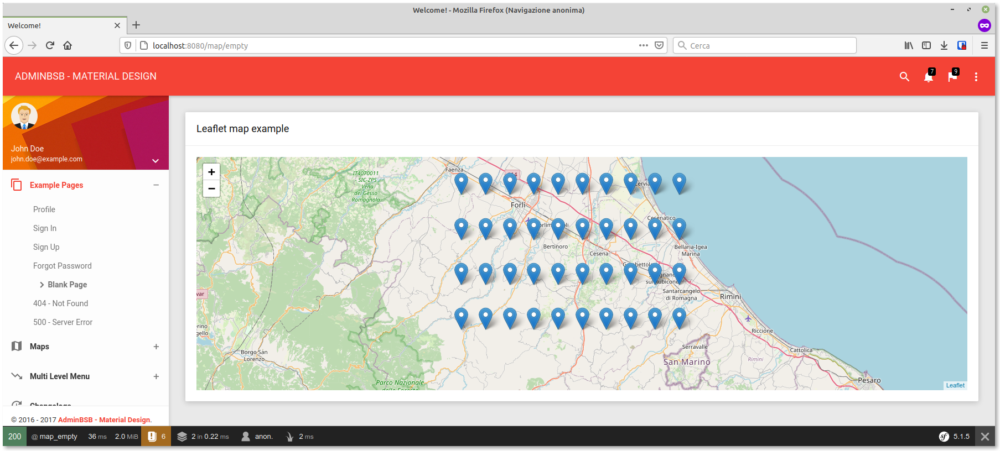

[#ricerca_marker]
== Marker

Per mostrare un ((marker)) su una mappa ((Leaflet)) usando Javascript, è necessario per prima cosa istanziare un oggetto di tipo Marker usando la funzione *L.marker()* (per la sintassi v.la <<leaflet_marker,documentazione di Leaflet>>); per far sì che Leaflet mostri il marker, possiamo scegliere se aggiungerlo direttamente alla mappa, oppure renderlo membro di un (((Leaflet, LayerGroup))) <<leaflet_layergroup, _LayerGroup_>>. In questo secondo caso, il marker diverrà visibile quando aggiungeremo il _LayerGroup_ alla mappa; noi sceglieremo questo metodo, per praticità: quando iniziamo una nuova ricerca, vogliamo ripulire la mappa dai marker già presenti; se dovessimo tener traccia di tutti i marker creati in precedenza, dovremmo salvarli in un array e chiamare il metodo *remove()* di ciascuno dei marker; se invece aggiungiamo tutti i marker ad un *LayerGroup*, basterà memorizzare solo quest'ultimo e rimuoverlo prima di aggiungere alla mappa i nuovi marker. +
Facciamo una prova: creiamo alcuni marker _a coordinate fisse_, aggiungiamoli ad un *LayerGroup*, e infine aggiungiamo il *LayerGroup* alla mappa: modifichiamo il codice JS nel template **guybrush/templates/map_empty.html.twig** come segue.

[source,html]
.Creazione di marker a coordinate fisse
----

----

Ricaricando la pagina http://localhost:8080/map/empty dovremmo vedere i marker disposti a rettangolo.

<<<

== Aggiungiamo un box di ricerca

// ****
// .icon:github[] Con il repository {sample_git_repo_web}

// Per tornare a questo punto del corso potete fare checkout del ramo *empty_map*. (((Git, git checkout)))

// [source,bash]
// ----
// cd /percorso/di/guybrush        # sostituite col percorso corretto
// git checkout empty_map
// ----
// ****

Ora faremo in modo che l'utente possa ricercare i punti di interesse usando il
box di ricerca presente nella _titlebar_: quando si preme kbd:[Invio] nel box di
ricerca, la pagina effettuerà una chiamata ((AJAX)) al backend, cercando i
*POI* corrispondondenti alla stringa contenuta nel campo di input. +
Prima di tutto modifichiamo il template base aggiungendo un *id* al campo di
input e racchiudendolo in un tag `form`.

[source,diff]
.guybrush/templates/base.html.twig
----
 <!-- Search Bar -->
 

   

     <i class="material-icons">search</i>
   

-         <input type="text" placeholder="START TYPING...">
+   <form action="" id="searchForm">
+     <input type="text" placeholder="Cerca in Guybrush" id="searchBox">
+   </form>
   

     <i class="material-icons">close</i>
   

 

 <!-- #END# Search Bar -->
----

Ora creiamo una nuova azione: per questo copiamo il template 
*guybrush/templates/map_empty.html.twig* in un nuovo file e aggiungiamo un
metodo al Controller (*SuperController.php*), ad es. come segue.

[source,php]
.Nuova azione in guybrush/src/Controller/SuperController.php
----
class SuperController{
  // ...

  /**
    * @Route("/map", name="map")
    */
  public function mapAction()
  {
    return $this->render('map_search.html.twig'); // <1>
  }
  
}
----

<1> : Inserite il percorso relativo del file template che avete copiato.

La gestione del campo di ricerca verrà effettuata da Javascript, e il posto più corretto in cui scrivere questo codice è nell'ultimo tag `<script>` della pagina, dopo il codice con cui abbiamo creato i marker fissi. Possiamo usare ((jQuery)) per "ascoltare" l'evento `submit` del form, ed usare `$.ajax()` nella funzione che chiameremo (detta anche _((handler))_). Per fornire all'utente un'esperienza soddisfacente bisogna evitargli attese inutili, quindi dovremo:

- *non* far partire una chiamata AJAX se ce n'è già una in corso: useremo per questo una variabile, impostata a `true` quando parte la chiamata, e resettata a `false` al ritorno della chiamata o in caso di errore; inoltre, disabiliteremo il pulsante _submit_ durante la chiamata;
- togliere gli spazi all'inizio e alla fine della stringa di ricerca, con il metodo `trim()` delle stringhe Javascript: gli spazi potrebbero causare falsi negativi nella ricerca;
- *non* effettuare ricerche di stringhe vuote o troppo corte (sotto i 3 caratteri);
- tenere traccia dell'_ultima stringa ricercata_, e non far partire la chiamata se la nuova stringa è uguale a quella vecchia; questo potrebbe succedere ad es. se l'utente preme il tasto kbd:[Shift], una freccia o la barra spaziatrice.

[source,javascript]
.La funzione di ricerca AJAX (senza feedback)
----
let last_query = ''; // <1>
let searching = false; // <2>

function search(e) {
  e.preventDefault();
  if (searching) {
    return; // <3>
  }
  const search_query = $('#searchBox').val().trim();
  if (!search_query || search_query.length < 3 || search_query === last_query) { // <4>
    console.debug("Invalid/same search query: '%s'", search_query);
    return;
  }
  console.debug("Search for: '%s'", search_query);
  searching = true;

  $('#searchBtn').attr('disabled', true);
  last_query = search_query; // <5>
  $.ajax('/api/v1/poi/search', {
    type: 'GET',
    data: {q: search_query},
    success: function (data) {
      console.debug("%o", data);
      if (typeof data.results === 'undefined' ||
          !data.results.length) {
        // @todo: mostra il messaggio "nessun risultato"
      } else {
        // @todo: mostra i marker
      }
      $('#searchBtn').attr('disabled', false);
      searching = false; // <6>
    },
    error: function () {
      // @todo: mostra un messaggio di errore
      $('#searchBtn').attr('disabled', false);
      searching = false; // <6>
    }
  });
}

$('#searchForm').on('submit', search); // <7>
----

<1> Variabile che contiene l'ultima stringa ricercata.
<2> Variabile che vale `true` se e solo se c'è una chiamata AJAX in corso.
<3> Se c'è una ricerca in corso, la chiamata non va effettuata.
<4> Se la stringa di ricerca è vuota o è uguale all'ultima, non va fatto niente.
<5> Da qui in poi la chiamata è in corso.
<6> Al ritorno della chiamata AJAX o in caso di errore, la ricerca è terminata.
<7> Associamo, tramite jQuery, un handler all'evento `submit`.
// Hint: per far comparire ⌘ in Linux: Ctrl-Shift-U fa comparire una u sottolineata. Quello è il modo di inserire un codepoint Unicode. Il simbolo del Cmd è il codepoint 2318.
Per verificare se tutto funziona, salviamo e ricarichiamo la pagina, quindi apriamo gli strumenti per sviluppatori del browser premendo kbd:[F12] / kbd:[cmd+alt+i], e proviamo a scrivere qualcosa nel campo di ricerca. Premendo kbd:[Invio], nella Console dovrebbero comparire alcuni messaggi che segnalano l'esito della ricerca.

### Template completo

[source,twig]
.guybrush/templates/map_search.html.twig
----
include::map_search.html.twig[]
----
