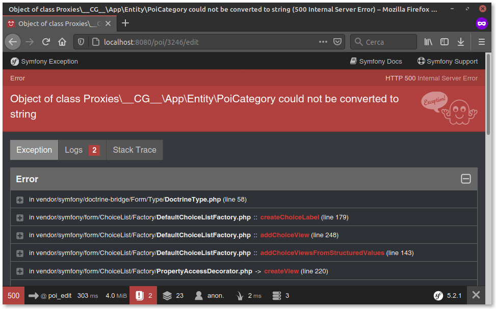
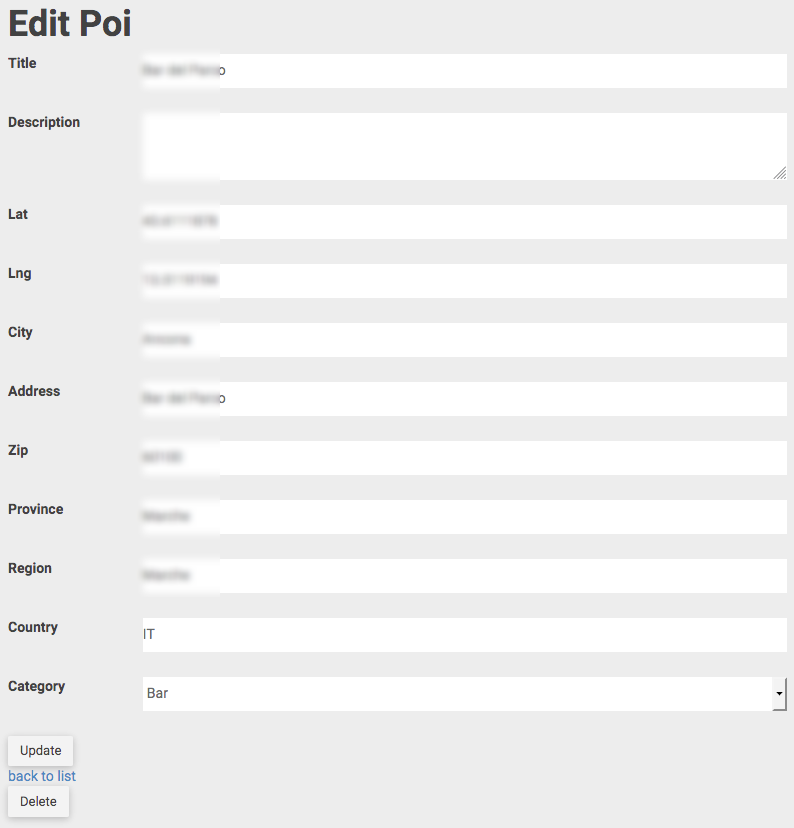

== Creiamo un _CRUD_

[TIP]
====
*((CRUD))* è l'acronimo di "**C**reate, **R**ead, **U**pdate, **D**elete", e in Symfony corrisponde all'insieme degli strumenti che permettono di _creare_, _elencare_, _aggiornare_ e _cancellare_ una specifica Entity, ovvero:

- un *controller* contenente le funzioni di creazione, elenco, visualizzazione, modifica e cancellazione della Entity;
- i *template* usati da questo controller;
- la classe *Form* corrispondente (nella directory */src/Form*).
====

Naturalmente esiste un _console command_ anche per creare un CRUD - `make:crud` - e possiamo sperimentarlo subito: dalla shell del container *guybrush_php8* diamo il comando seguente.

[source,bash]
----
php bin/console make:crud Poi
----

Il comando *make:crud* crea un nuovo _((Controller))_, contenente cinque metodi associati ad altrettante _((Route))_. I nomi di _Controller_ e _Route_ ricalcheranno quello della _((Entity))_: se questa ad es. si chiama _PippoPluto_, il controller si chiamerà _PippoPluto**Controller**_, e conterrà i metodi e le rotte seguenti:

. _index()_ (route */pippopluto/*): elenco delle Entity _PippoPluto_;
. _new()_ (*/pippopluto/new*): form di creazione di una nuova Entity;
. _show()_ (*/pippopluto/{id}*) (metodo HTTP _GET_): pagina che _mostra il dettaglio_ della Entity avente id *\{id\}*;
. _delete()_ (*/pippopluto/{id}*) (metodo HTTP _DELETE_): pagina di _cancellazione_ della Entity avente id *\{id\}*;
. _edit()_ (*/pippopluto/{id}/edit*): form di _modifica_ della Entity avente id *\{id\}*.

In altre parole, tutte le _route_ di questo _Controller_ hanno prefisso uguale al nome della Entity tutto minuscolo. +
Tornando al nostro progetto, abbiamo appena creato un CRUD per la Entity *Poi*, quindi al controller è stato dato il nome "_Poi**Controller**_", e tutte le _route_ hanno prefisso */poi/*.

La velocità con cui possiamo creare un CRUD ha anche qualche controindicazione. Ad es., la pagina http://localhost:8080/poi/[/poi/] mostra _tutti_ i record presenti nella tabella della _Entity_, senza paginazione: ciò non sarebbe un problema se in tabella avessimo solo un centinaio di record (sarebbe già scomodo da leggere), ma con migliaia di record il peso della pagina può diventare imponente -circa _5 megabyte_ di HTML per diecimila record-, e spostarsi nella tabella può rivelarsi frustrante.

.Tempo di caricamento per 10000 Poi

Per ovviare a questo problema, per ora possiamo far visualizzare alla pagina un *numero limitato* di risultati (non è una soluzione di fondo, ma permette di proseguire). Apriamo il file src/Controller/*PoiController.php* e cerchiamo il metodo *index()*. In esso, sostituiamo la chiamata `findAll()` con la più flessibile `findBy()`, che permette di _filtrare_ i record, _ordinarli_ in base a uno o più campi, e -quel che qui c'interessa- *_limitare_* il numero di record restituiti.

[source,diff]
.Azione PoiController::index (elenco)
----
public function index(PoiRepository $poiRepository): Response {
  return $this->render('poi/index.html.twig',
-         ['pois' => $poiRepository->findAll()]); // <1>
+         ['pois' => $poiRepository->findBy([], null, 50)]); // <2>
}
----
<1> il metodo *findAll()* non permette di limitare il numero di risultati.

<2> nel metodo *findBy()*, il primo argomento (condizioni di filtro) è vuoto perché non vogliamo escludere alcun record; il secondo argomento (ordinamento) al momento non ci interessa, e con il *terzo* argomento limitiamo a *50* il numero di record restituiti.

.Tempo di caricamento per 50 Poi

Il risultato di questa modifica è un bel guadagno in performance: caricamento della pagina in un _settantesimo_ del tempo (0,15s/10,58s) e peso dell'HTML ridotto del 98%. +
Ora che la pagina è tornata utilizzabile possiamo dare un'occhiata al CRUD che il comando `make:crud` ha creato per noi: nella pagina elenco, in ciascuna riga sulla destra sono presenti i link *Show* e *Edit*, che portano rispettivamente alla pagina di *dettaglio* e a quella di *modifica* del _POI_.

.Pagina di dettaglio del POI

Se proviamo a cliccare sul link *edit*... che succede? Il form di modifica causa un errore! Perché?

.Il form di modifica curiosamente causa un errore HTTP 500.

Niente paura, tutto va come previsto. Se non vi interessa sapere cosa è successo, v. la <<tostring,soluzione veloce>>.

=== Perché il form di modifica si rompe

L'errore è dovuto al fatto che la _Entity_ *Poi* contiene un campo,_Category_, di tipo ManyToOne. Per questo tipo di campo, quando creiamo un CRUD, il (((Form))) form di inserimento e modifica produce un `input` di tipo _select_ (cioè un menù a tendina) contenente tutte le possibili scelte, cioè tutti i record della tabella collegata (in questo caso, tutti i *PoiCategory*). Symfony è sufficientemente autonomo da capire la correlazione e recuperare l'elenco di Entity PoiCategory, ma per produrre il _select_ gli manca un'informazione, ossia *cosa mostrare come etichetta*: di qui l'errore che abbiamo incontrato.

Il modo corretto di _spiegare_ a Symfony come fare è configurare il campo del form, cioè modificare il metodo `buildForm()` della classe *PoiType* (nel file *src/Form/PoiType.php*), aggiungendo due argomenti alla chiamata `$builder->add('category')`, come segue:

[source, diff]
./src/Form/PoiType.php: metodo buildForm()
----
        $builder
          ->add('title')
          ->add('description')
          ->add('coords')
          ->add('city')
          ->add('address')
          ->add('zip')
          ->add('province')
          ->add('region')
          ->add('country')
          ->add('updatedAt')
-         ->add('category');
+         ->add('category',
+           EntityType::class,
+           [
+             'class'        => PoiCategory::class,
+             'choice_label' => 'title',
+           ]
+         )
        ;
----

Per ulteriori informazioni sul campo EntityType, v. la [documentazione ufficiale](https://symfony.com/doc/current/reference/forms/types/entity.html#basic-usage).

[#tostring]
=== Un'altra soluzione veloce

Un _workaround_ non elegantissimo ma veloce, è aggiungere il metodo (((toString))) `__toString()` alla classe *PoiCategory* e fargli restituire un valore significativo, ad esempio il campo `title` della Entity.

[source,php]
.src/Entity/PoiCategory.php
----
/**
 * @ORM\Entity(repositoryClass=PoiCategoryRepository::class)
 */
class PoiCategory
{
    // ...
    
    public function __toString()
    {
        return $this->getTitle();
    }
}
----

Così facendo il form convertirà senza errori le *PoiCategory* in stringhe, mostrando il *titolo* di ciascuna di esse. (((Form, Stile CSS)))

== Stile dei form

Il form di modifica non ha alcuno stile CSS per cui ha un aspetto un po' spartano; in più, mostra tutti i campi della Entity (anche _Updated On_, che non dovrebbe essere modificabile), i menu a tendina sono sdoppiati, e il campo *Country* non è utilizzabile agevolmente, visto che contiene il codice ISO a 2 cifre della nazione: se volessimo utilizzarlo dovremmo ricordarci i codici ISO a memoria. A questo problema ovvieremo <<country_field,più avanti>>.

.Form di modifica del POI

(((Come fare per..., Cambiare stile globale dei form)))
[#form_bootstrap]
=== Bootstrap per i form

I form predefiniti di Symfony hanno un markup essenziale, che li rende poco accattivanti: vediamo come migliorare il loro aspetto. +
Symfony utilizza template specifici per generare ciascuna sezione del form, ed è possibile personalizzare ogni minimo dettaglio, modificando quel che ci serve, ma se ci basta usare gli stili CSS di ((Bootstrap)) possiamo farlo rapidamente, come spiegato in un post footnote:bootstrap[New in Symfony 3.4: Bootstrap 4 form theme https://symfony.com/blog/new-in-symfony-3-4-bootstrap-4-form-theme] nel sito di Symfony. +
Nel post l'autore spiega come cambiare stile per _uno specifico form_ oppure _globalmente_; siccome non ritengo molto utile applicare lo stile di Bootstrap ad _un solo form_, vediamo come modificare lo stile globale: basta aggiungere una riga al file */config/packages/twig.yaml* come segue. +

[source,diff]
./config/packages/twig.yaml
----
twig:
    paths: ['%kernel.project_dir%/templates']
+   form_themes: ['bootstrap_4_horizontal_layout.html.twig']
----

Tornando alla pagina di modifica di un _POI_, potremo apprezzarne l'aspetto più ordinato.

.Form di modifica con layout Bootstrap

=== Campo superfluo: updatedAt

Il comando `make:crud` non può sapere in anticipo quali campi sono fondamentali e quali no, dunque inserisce nei form di creazione e modifica _tutti_ i campi della Entity. nel nostro caso il campo _updatedAt_ viene valorizzato automaticamente dalla (((Doctrine Extensions, Timestampable))) Doctrine Extension *Timestampable*, e quindi non ha senso che compaia nel form. +
La definizione del form è contenuta nella classe *src/Form/PoiType.php*, che estende *Symfony\Component\Form\AbstractType*; nello specifico, i campi presenti nel form vengono elencati nel metodo `buildForm()` della classe *PoiType*; questo metodo chiama, per ciascun campo del form, il metodo `add()` dell'interfaccia *((FormBuilderInterface))*. +
Quindi, per togliere il campo *updatedAt* sarà sufficiente commentare o cancellare la corrispondente istruzione `add()` nel metodo `buildForm()` di *PoiType*.

[source,diff]
./src/Form/PoiType.php: metodo buildForm()
----
    $builder
      ->add('title')
      ->add('description')
      ->add('coords')
      ->add('city')
      ->add('address')
      ->add('zip')
      ->add('province')
      ->add('region')
      ->add('country')
-     ->add('updatedAt')
      ->add('category',
            EntityType::class,
            [
              'class'        => PoiCategory::class,
              'choice_label' => 'title',
            ])
    ;
----

C'è ancora una sbavatura icon:frown-o[] : il campo *Category* ha _due_ menu dropdown, uno sopra l'altro. Come mai? +
Il template _{template_name}_ usa il plugin Javascript *bootstrap-select*, che sostituisce i tag *select* predefiniti del browser con un dropdown più carino (o meglio, crea un widget aggiuntivo nascondendo il _select_ originale). Nel nostro form però, qualcosa non va per il verso giusto, e siccome il dropdown di Bootstrap è già più bello di quello di default, ci viene più facile disattivare globalmente il plugin *bootstrap-select*. Nel file */templates/base.html.twig* troviamo la riga seguente e commentiamola (ricordiamo che in ((Twig)) i commenti sono racchiusi tra `{\#` e `#}`).

[source,diff]
./templates/base.html.twig
----
 <!-- Select Plugin Js -->
-
+{#  #}
----

.Form di modifica senza plugin bootstrap-select

[#country_field]
== Campo di tipo _Country_

(((Campo di tipo Country))) Il campo _Country_ della Entity *Poi* contiene il codice ISO a due cifre della nazione in cui si trova il punto di interesse.

TIP: Questo codice è denominato https://it.wikipedia.org/wiki/ISO_3166-1_alpha-2[ISO-3166-1 Alpha-2].

Questo campo rappresenta un caso tipico di campo "a scelta obbligata", cioè dovrebbe accettare solo valori appartenenti ad un insieme limitato, all'infuori dei quali diventa "non valido"; infatti, le combinazioni di caratteri come ad esempio ZX, WW, KB, ecc. non corrispondono al codice ISO di nessun Paese. +
Siccome nella entity *Poi* il campo _Country_ è una colonna di tipo *stringa*, il comando `make:crud` ha creato un campo di testo libero (che in HTML corrisponde a un `<input type="text">`); a noi però serve un `<select>`; inoltre, ci farebbe comodo non doverci ricordare il codice ISO, ma usare il nome "umano" del Paese (ad es. _Sudafrica_ invece di *ZA*). +
Symfony può gestire campi di tipo "nazione", come questo, in maniera del tutto automatica: per dirgli che il campo in questione non è una _stringa_ ma il _codice ISO_ di un Paese, è necessario specificare il tipo di campo come secondo argomento della chiamata ad *add()* nel metodo *buildForm()* della classe *PoiType*.

[source,diff,linenums]
.src/Form/PoiType.php Il metodo PoiType::buildForm
----
public function buildForm(FormBuilderInterface $builder, array $options) {
  $builder
          ->add('title')
          ->add('description')
          ->add('coords')
          ->add('city')
          ->add('address')
          ->add('zip')
          ->add('province')
          ->add('region')
-          ->add('country')
+          ->add('country', CountryType::class)
          ->add(
            'category',
            EntityType::class,
            [
              'class'        => PoiCategory::class,
              'choice_label' => 'title',
            ]
          )
  ;
}
----

Se *non* stai usando PhpStorm (che lo fa in automatico), aggiungi anche l'opportuna direttiva `use` all'inizio del file:

[source,php]
----
use Symfony\Component\Form\Extension\Core\Type\CountryType;
----

TIP: Il sito ufficiale di Symfony ha una sezione dedicata ai form e ai tipi di campi. Qui abbiamo usato le informazioni contenute nella pagina relativa al campo di tipo Country, <https://symfony.com/doc/current/reference/forms/types/country.html>.

Proviamo ora  a visitare la pagina di modifica di un POI a scelta, e dovrebbe finalmente avere un aspetto coerente con il template.

image::images/1.crud-62635.png[pdfwidth=50%]

#@todo: come cambiare le label dei campi#
