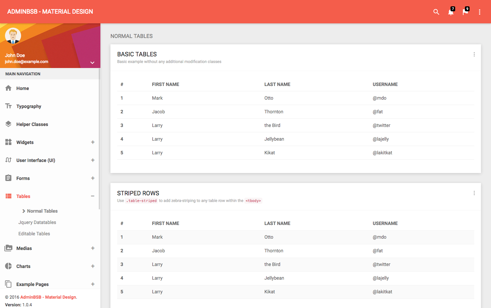
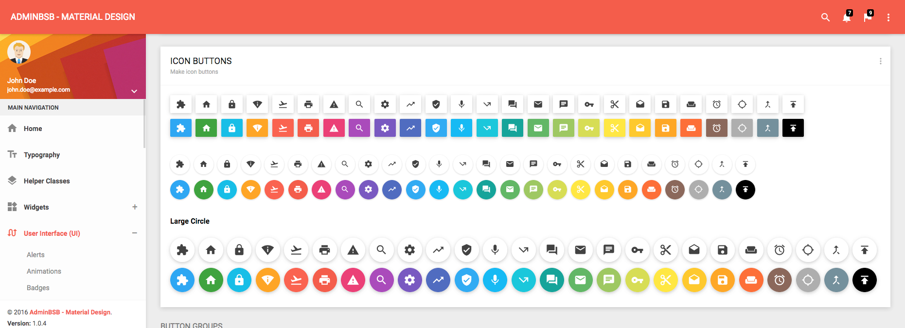
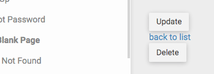

== Abbelliamo il CRUD

=== Colonne di troppo in elenco

Il template della pagina elenco, generato da `make:crud`, mostra una semplice tabella HTML che contiene *tutti* i POI presenti a database e ne mostra *tutti* i campi. +
Probabilmente non ci serve questo livello di dettaglio: le colonne _description_, _coords_  e _updatedAt_ possono essere omesse, almeno in questa vista d'insieme. Per farlo, nel template  */templates/poi/index.html.twig* cancelliamo sia i tag `<th>` che i tag `<td>` corrispondenti alle colonne:

[source,diff]
./templates/poi/index.html.twig
----
 

 Poi index

 
     <h1>Poi index</h1>

     <table class="table">
         <thead>
             <tr>
                 <th>Id</th>
                 <th>Title</th>
-                <th>Description</th>
-                <th>Coords</th>
                 <th>City</th>
                 <th>Address</th>
                 <th>Zip</th>
                 <th>Province</th>
                 <th>Region</th>
                 <th>Country</th>
-                <th>UpdatedAt</th>
                 <th>actions</th>
             </tr>
         </thead>
         <tbody>
         
             <tr>
                 <td>{{ poi.id }}</td>
                 <td>{{ poi.title }}</td>
-                <td>{{ poi.description }}</td>
-                <td>{{ poi.coords }}</td>
                 <td>{{ poi.city }}</td>
                 <td>{{ poi.address }}</td>
                 <td>{{ poi.zip }}</td>
                 <td>{{ poi.province }}</td>
                 <td>{{ poi.region }}</td>
                 <td>{{ poi.country }}</td>
-                <td>{{ poi.updatedAt ? poi.updatedAt|date('Y-m-d H:i:s') : '' }}</td>
                 <td>
                     <a href="{{ path('poi_show', {'id': poi.id}) }}">show</a>
                     <a href="{{ path('poi_edit', {'id': poi.id}) }}">edit</a>
                 </td>
             </tr>
         
             <tr>
-                <td colspan="12">no records found</td>
+                <td colspan="9">no records found</td>
             </tr>
         
         </tbody>
     </table>

     <a href="{{ path('poi_new') }}">Create new</a>
 
----

<<<

=== Stile della tabella

Il template *{template_name}* contiene http://localhost:8081/pages/tables/normal-tables.html[diversi esempi di tabelle] che utilizzano gli stili CSS di ((Bootstrap)) - perché non usarle?

.Il file *{template_name}/pages/tables/normal-tables.html*

Potremmo ad es. applicare lo stile *Striped rows* alla tabella. Per farlo basta aggiungere la classe CSS _table-striped_ al tag `<table>` presente sempre nel file */templates/poi/index.html.twig*.

[source,diff]
./templates/poi/index.html.twig
----
 <h1>Poi list</h1>

-    <table class="table">
+    <table class="table table-striped">
----

<<<

Possiamo fare di più. Diamo un'occhiata al markup utilizzato in *{template_name}* per creare quei simpatici pannelli bianchi chiamati *card*: apriamo il file *http://localhost:8081/pages/tables/normal-tables.html[{template_name}/pages/tables/normal-tables.html]* e cerchiamo la stringa _BASIC TABLES_; vedremo che si trova all'interno di un markup simile.

[source,html]
----

  

    

      
 <!-- Intestazione (opzionale) della card -->
        <h2>
          Titolo della card
          <small>Eventuale sottotitolo</small>
        </h2>
      
 <!-- END card header -->

      

        <!-- Tabella -->

        <!-- Pulsante "add" -->

      
 <!-- END card body -->

    
 <!-- END card -->
  

----

Possiamo spostare il titolo della pagina eliminando il tag *_<h1>_*, e usare il markup qui sopra per avvolgere la tabella, ottenendo qualcosa di simile:

[source,html]
----

  

    

      

        

          <h2>Poi list</h2>
        

        

          <table class="table table-striped">
            <thead>
            <tr>
              <th>Id</th>
              <!-- altri th... -->
            </tr>
            </thead>
            <tbody>
            
              <tr>
                <td>{{ poi.id }}</td>
                <!-- altri td... -->
              </tr>
            
              <tr>
                <td colspan="9">no records found</td>
              </tr>
            
            </tbody>
          </table>

          <a class="btn bg-amber" href="{{ path('poi_new') }}">Create new</a>
        

      

    

  


----

==== Pulsanti al posto di link

I link *edit* e *show* nella colonna *actions* non sono proprio bellissimi da vedere: potremmo rimpiazzarli con due pulsanti. A questo scopo vediamo la pagina *http://localhost:8081/pages/ui/buttons.html[{template_name}/pages/ui/buttons.html]*, alla sezione "Icon buttons".

Possiamo scegliere il tipo di pulsanti che ci piace di più; io ho optato per quelli rotondi (i più piccoli), di colore verde per _show_ e arancio per _edit_. Il markup di questi pulsanti è il seguente:

[source,html]
----
<button type="button"
  class="btn bg-#COLORE# btn-circle waves-effect waves-circle waves-float"> <1>
  <i class="material-icons">#nome_material_icon#</i> <2>
</button>
----

<1> _COLORE_ è il nome di uno dei colori disponibili; l'elenco è riportato nella pagina *http://localhost:8081/pages/ui/colors.html[User Interface > Colors]* del template.

<2> I nomi delle _Material icons_ sono riportati nella pagina *http://localhost:8081/pages/ui/icons.html[User Interface > Icons]* del template.

NOTE: Le classi CSS che iniziano per _btn_ possono essere applicate indifferentemente a tag `<button>` e `<a>`, quindi potremo modificare i tag `<a>` esistenti.

[source,diff]
.Le nostre modifiche al markup predefinito
----
-<td>
+<td class="text-right">
-  <a href="{{ path('poi_show', {'id': poi.id}) }}">show</a>
+  <a href="{{ path('poi_show', {'id': poi.id}) }}"
+   class="btn bg-light-green btn-circle waves-effect waves-circle waves-float">
+    <i class="material-icons">search</i>
+  </a>
-  <a href="{{ path('poi_edit', {'id': poi.id}) }}">edit</a>
+  <a href="{{ path('poi_edit', {'id': poi.id}) }}"
+   class="btn bg-amber btn-circle waves-effect waves-circle waves-float">
+    <i class="material-icons">mode_edit</i>
+  </a>
 </td>
----

<<<

.Gli altri pulsanti

Ora che sappiamo come fare, possiamo migliorare anche l'aspetto un po' imbarazzante dei pulsanti e del link presenti nelle pagine _edit_, _show_ e _new_:

I pulsanti sono tag `<button>` a cui basta aggiungere le classi CSS che vogliamo; ad es. i pulsanti "Save" del form di creazione e "Update" del form di modifica sono entrambi creati tramite il template *templates/poi/_form.html.twig*.

[source,twig]
.templates/poi/_form.html.twig
----
{{ form_start(form) }}
  {{ form_widget(form) }}
  <button class="btn bg-blue waves-effect waves-float"> <1>
    {{ button_label|default('Save') }}
  </button>
{{ form_end(form) }}
----

<1> Coloriamo il tag `<button>` con una classe CSS *bg-...*; le classi *waves-effect* e *waves-float* servono per mostrare l'effetto _wave_ di Material Design quando lo clicchiamo.

Per dare l'aspetto di pulsanti ai link _Create new_ della pagina elenco, _edit_ della pagina dettaglio, e _back to list_, è sufficiente aggiungervi le classi CSS `btn`, e opzionalmente `bg-...` per colorarli.

Il pulsante _Delete_ invece è contenuto in un template/form a sè stante: */templates/poi/_delete_form.html.twig*. Un form a parte, che non ha campi ma contiene *solo* il pulsante di _submit_. Perché? +
Questa scelta apparentemente strana è una precauzione di Symfony per evitare cancellazioni accidentali: per cancellare un record, infatti, è necessario chiamare la rotta corrispondente all'azione *PoiController::delete()* usando il metodo HTTP *DELETE*, e con questo form Symfony fa un _escamotage_ per raggiungere l'azione di cancellazione. (((Come fare per...,Cambiare metodo di un form)))

[NOTE]
.Come cambiare il metodo HTTP di un form (solo in Symfony)
====
L'azione di cancellazione del nostro CRUD, cioè *PoiController::delete()*, risponde solo se viene chiamata usando il metodo HTTP *_DELETE_*. +
Per usare metodi HTTP diversi da GET e POST, in generale, è necessario effettuare la richiesta tramite script (ad es. usando AJAX, o _((curl))_ da PHP); infatti, i form HTML possono usare solo GET e POST. +
Symfony permette di "fingere" di effettuare una richiesta HTTP con un metodo diverso da GET e POST nel modo seguente (come documentato https://symfony.com/doc/current/forms.html#changing-the-action-and-http-method[qui]):

. effettuando la chiamata con metodo POST;
. passando un parametro di nome *_method* contenente il valore del metodo desiderato (ad es. "DELETE" o "PUT").

In questo caso, il Router di Symfony interpreterà la chiamata _come se_ fosse stata effettuata con il metodo specificato al parametro *_method*. +
Questo è esattamente ciò che fa il form/pulsante Delete; nel template infatti è presente un campo nascosto di nome *_method* e valore *DELETE*:

[source,html]
----
<form method="post" action="..." onsubmit="...">
    <input type="hidden" name="_method" value="DELETE">
    <!-- resto del form -->
</form>
----
====
