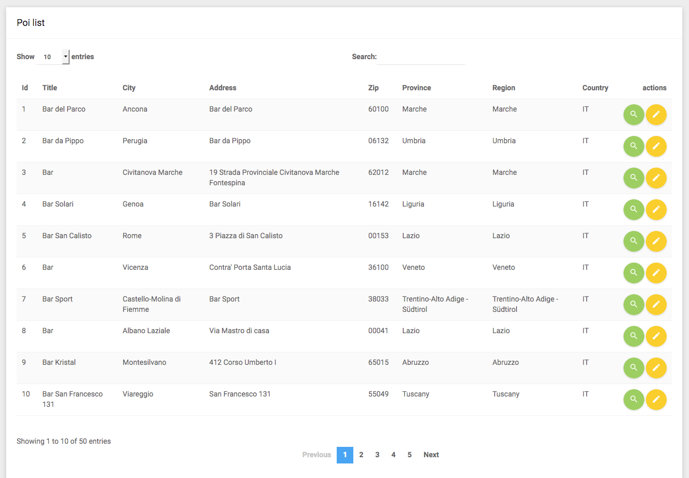

== Paginazione

:jqdt: jQuery DataTables
// Latest release of Datatables
:jqdatatables_version: 1.10.23

Per potersi dire funzionante, il nostro CRUD deve permettere di "raggiungere" tutti i record della tabella _POI_. Visualizzarli tutti insieme non è efficiente, perciò va implementata una qualche forma di paginazione. +
Il template *{template_name}* ci può suggerire una soluzione: la libreria <<jqDatatables,_(({jqdt}))_>> serve per visualizzare dati in formato tabellare e gestisce paginazione e ordinamento; possiamo cominciare ad utilizzarla _quasi_ senza modificare il markup del template. Perché il tutto funzioni, dobbiamo prima aggiungere un ID alla tabella dei punti di interesse, ad es. così:

[source,html]
----

  <table class="table table-striped" id="poi_table">
    <thead>
----

Aggiungiamo quindi il blocco *javascripts* in cui includere la libreria e crere un'istanza di _DataTable_, come segue (possiamo posizionare il blocco dove vogliamo, ad es. sotto il blocco _title_).

[source,html]
./templates/poi/index.html
----

  
  
  

----

<1> L'id passato al selettore jQuery (in questo caso *poi_table*) deve coincidere con quello assegnato alla tabella.

Se ricarichiamo la http://localhost:8080/poi/[pagina di elenco dei POI], dovrebbe avere un aspetto simile a questo.

Senza che dovessimo specificare alcun parametro, _jQuery Datatables_ ha aggiunto un paginatore, un box di ricerca funzionante e la possibilità di ordinare le righe della tabella in base a ciascuna colonna (provate a cliccare sulle intestazioni). Non male! +
Però, se istanziamo la DataTable in questo modo, in essa saranno presenti solo i valori contenuti nel *markup iniziale della pagina*, cioè nel nostro caso caso 50 record. Questo modo di paginare i dati è detto _paginazione client side_, perché le logiche di ordinamento e selezione dei record vengono eseguite da Javascript nel browser (client). Noi abbiamo bisogno invece di navigare fra tutti i record della tabella, e per farlo abbiamo bisogno di caricare i risultati paginati tramite AJAX.

=== Utilizziamo la versione più recente

Per proseguire useremo la versione più recente della libreria {jqdt} (nel momento in cui scrivo, è la *{jqdatatables_version}*); questo ci obbliga a modificare il codice del template, ma ci permetterà di seguire alla lettera la documentazione del sito ufficiale https://datatables.net/manual/ .

Aggiungiamo il foglio di stile della libreria tramite il blocco _stylesheets_.

[source,twig,subs="attributes"]
.templates/poi/index.html.twig: blocco stylesheets
----

  <link rel="stylesheet" href="//cdn.datatables.net/{jqdatatables_version}/css/dataTables.bootstrap.min.css">

----

Cambiamo gli URL delle librerie nel blocco _javascripts_:

[source,twig,subs="attributes"]
.templates/poi/index.html.twig: librerie aggiornate nel blocco javascripts
----


...

----

Ricaricando la pagina http://localhost:8080/poi/, dovrebbe funzionare esattamente come prima. +

=== Endpoint (Azione in ApiController) (((API, endpoint)))

Ora creiamo il "backend" che permetterà a {jqdt} di effettuare la paginazione via AJAX: scriveremo un'azione nel ((Controller)) *ApiController* che abbiamo creato <<c40-mappa#apicontroller,qualche lezione fa>>, e faremo in modo che la libreria {jqdt} la utilizzi per recuperare le righe della tabella. +
Si parla in questo caso di _paginazione server side_, perché le logiche di ordinamento e di lettura dei record da mostrare sono demandate al backend, diversamente da quanto avviene ora: Datatables chiamerà il nostro _endpoint_ e gli passerà i parametri descritti nella <<jqDatatables_server_side,documentazione ufficiale>>. +
Per ora fra i vari parametri ci interessano solo questi tre:

- *length*: numero di record da restituire (dimensione della pagina);
- *start*: offset del primo record da restituire (uguale numero della pagina moltiplicato per *length*); nota bene: la prima pagina è la numero _zero_;
- *draw*: numero sequenziale della richiesta AJAX; il nostro endpoint dovrà restituire lo stesso valore, e in tal modo {jqdt} identificherà la risposta.

La risposta che {jqdt} si aspetta è di tipo ((JSON)) e deve contenere queste quattro chiavi, come mostrato nell'esempio sotto:

. *draw*: lo stesso valore ricevuto come parametro;
. *recordsTotal*: numero _totale_ di record presenti nella tabella;
. *recordsFiltered*: in presenza di filtri, questo è il numero totale dei record che _soddisfano i filtri attivi_; per adesso sarà uguale a *recordsTotal*;
. *data*: array di record che costituiscono la pagina corrente.

[source,json]
.Esempio di risposta per Datatables
----
{
  "draw": 1,
  "recordsTotal": 9948,
  "recordsFiltered": 9948,
  "data": [
    {
      "id": 4321,
      "title"
    },
    // ...
  ]
}
----

Il nostro _endpoint_ dovrà effettuare una query a database per leggere la pagina corrente di record: per farlo, userà un nuovo metodo della classe *PoiRepository*, che restituirà un array di *tre* elementi che costituiranno i valori di *recordsTotal*, *recordsFiltered* e *data*.

[source,php]
.src/Controller/ApiController.php
----
/**
  * @Route("poi/page", name="api_poi_page")
  * @param Request $request
  * @return JsonResponse
  */
public function poiDataTablesPage(Request $request): JsonResponse
{
    /** @var PoiRepository $repo */
    $repo = $this->getDoctrine()->getRepository('App:Poi');
    list($data, $filtered, $total) = $repo->getDataTablesPage($request);
    $json = [
      "draw"            => $request->get("draw", 1),
      "recordsTotal"    => $total,
      "recordsFiltered" => $filtered,
      "data"            => $data,
    ];

    return new JsonResponse($json);
}
----

[source,php]
.src/Repository/PoiRepository.php: nuovo metodo getDataTablesPage()
----
/**
  * @param Request $request
  * @return array
  * @throws NonUniqueResultException|NoResultException
  */
public function getDataTablesPage(Request $request): array
{
    $start = $request->get("start", 0);
    $limit = $request->get("length", 10);
    $qb = $this->createQueryBuilder('p');
    $data = $qb
      ->select(
        [
          'p.id',
          'p.title',
          'p.city',
          'p.address',
          'p.zip',
          'p.province',
          'p.region',
          'p.country',
        ]
      )
      ->setFirstResult($start)
      ->setMaxResults($limit)
      ->getQuery()
      ->getArrayResult();
    $qb_count = $this->createQueryBuilder('p');
    $total = $qb_count->select(['count(p)'])->getQuery()->getSingleScalarResult();

    return [$data, $total, $total];
}
----

Per verificare se l'_endpoint_ funziona, proviamo a visitarlo con il browser aggiungendo i parametri che richiede, ad es.: <http://localhost:8080/api/v1/poi/page?draw=1&start=121&length=7> .

TIP: I parametri `start` e `length` hanno valori di default (rispettivamente *0* e *10*), per cui possono essere omessi, ma per verificare che vengano utilizzati nel modo richiesto li dovremo comunque specificare.

=== Cabliamo icon:fas-plug[]

Ora che il "backend" è pronto, possiamo dire a {jqdt} di usarlo. L'oggetto da passare alla funzione Javascript *$().DataTable()* dovrà contenere parametri diversi, nella fattispecie:

- *serverSide*: specifica che la sorgente dei dati *non* è il markup iniziale della pagina bensì uno *script lato server*;
- *ajax*: l'URL dello script da chiamare, cioè l'URL del nostro _endpoint_;
- *columns*: elenco ordinato delle colonne che {jqdt} si aspetta nella risposta;
- *processing*: mostra un messaggio durante il caricamento dei dati via AJAX.

[source,html, subs="attributes"]
.templates/poi/index.html.twig: modifiche al blocco javascripts
----

  
  
  

----

I contenuti della tabella ora vengono caricati tramite AJAX, per cui non è più necessario popolare la tabella con i dati che abbiamo visualizzato finora (cioè i primi 50 record). Nel template Twig, quindi, eliminiamo il tag *<tbody>* e ricopiamo *<thead>* in *<tfoot>*.

[source,html]
.templates/poi/index.html.twig: tabella per lettura ServerSide
----
<table class="table table-striped" id="poi_table">
  <thead>
  <tr>
    <th>Id</th>
    <th>Title</th>
    <th>City</th>
    <th>Address</th>
    <th>Zip</th>
    <th>Province</th>
    <th>Region</th>
    <th>Country</th>
    <th>actions</th>
  </tr>
  </thead>
  <tfoot>
  <tr>
    <th>Id</th>
    <th>Title</th>
    <th>City</th>
    <th>Address</th>
    <th>Zip</th>
    <th>Province</th>
    <th>Region</th>
    <th>Country</th>
    <th>actions</th>
  </tr>
  </tfoot>
</table>
----

<<<

Infine, nell'azione *index()* del Controller *PoiController* rimuoviamo sia l'argomento del metodo, sia il secondo argomento dalla chiamata *$this\->render()*, perché non abbiamo più bisogno di fare query e passare il risultato al template.

[source,diff]
.src/Controller/PoiController.php
----
     /**
      * @Route("/", name="poi_index", methods={"GET"})
      */
-     public function index(PoiRepository $poiRepository): Response
+    public function index(): Response
     {
-        return $this->render('poi/index.html.twig',
-          [
-            'pois' => $poiRepository->findBy([], null, 50),
-          ]
-        );
+        return $this->render('poi/index.html.twig');
     }
----

Se non abbiamo sbagliato niente, visitando la pagina http://localhost:8080/poi/ ora vedremo i record paginati che {jqdt} carica tramite AJAX.

=== Link ai dettagli

Forse avrai notato che nell'elenco paginato dei record non ci sono più i link alle pagine _dettaglio_ e _modifica_: niente paura, possiamo ovviare modificando leggermente la configurazione della DataTable nel blocco _javascripts_.

[source,javascript]
.Configurazione dell'ultima colonna (*actions*)
----
{
  'data': null,
  'orderable': false,
  'width': '90px',
  'defaultContent': '<a ' +
      '   class="show_button btn bg-light-green btn-circle waves-effect waves-circle waves-float">' +
      '    <i class="material-icons">search</i>' +
      '  </a> ' +
      '<a class="edit_button btn bg-amber btn-circle waves-effect waves-circle waves-float">' +
      '    <i class="material-icons">mode_edit</i>' +
      '</a>'
}
----

Ora le icone della lente e della matita sono ricomparse in ciascuna riga, ma... non fanno ancora niente. + 
Per eseguire una funzione Javascript al click su questi pulsanti, possiamo associarvi due _listener_ con ((jQuery)), come mostrato in <<jqDatatables_null_datasource,un esempio>> nella documentazione di {jqdt}. I nostri listener non faranno niente di trascendentale: faranno puntare il browser alle pagine di dettaglio e modifica del record contenuto nella riga corrispondente della tabella.

[source,javascript]
.Listener per il click sulle icone edit e show
----
$('#poi_table tbody').on('click', 'a.show_button', function () {
  const data = table.row($(this).parents('tr')).data();
  document.location.href = '/poi/' + data.id;
});
$('#poi_table tbody').on('click', 'a.edit_button', function () {
  const data = table.row($(this).parents('tr')).data();
  document.location.href = '/poi/' + data.id + '/edit';
});
----

IMPORTANT: Queste istruzioni devono trovarsi nella stessa <<javascript_closure,closure JS>> nella quale istanziamo la DataTable, altrimenti la variabile *table* risultrà _undefined_.

==== Cosa abbiamo imparato

Per dichiarare i _listener_ abbiamo usato un metodo che permette di associare una funzione a elementi del ((DOM)) che corrispondono ad un particolare selettore jQuery, *indipendentemente* dal fatto che quel selettore abbia elementi che vi corrispondono oppure no. Se, in un qualsiasi momento, nel DOM viene iniettato almeno un elemento che vi corrisponde, il listener verrà attivato su quell'elemento.

[source,javascript]
.Associare un listener a oggetti DOM non ancora creati
----
$('#poi_table tbody').on('click', 'a.show_button', function () {
  // ...
});
----

#@todo completare#

[source,javascript]
.Accedere ad una riga di DataTable
----
// $tr è l'oggetto jQuery corrispondente al tag 'tr'
var data = table.row($tr).data();
console.log(data.id, data.title);
----

#@todo completare#

=== Ordinamento e ricerca

@todo completare
