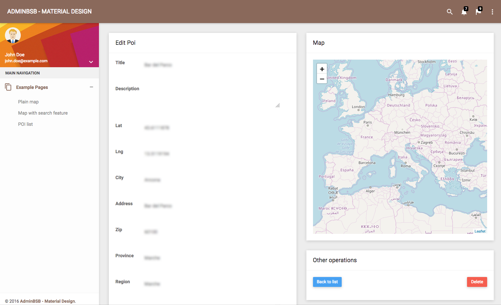

== Aggiungiamo una mappa al form

In questa lezione aggiungeremo ai form di creazione e modifica una mappa interattiva che permetterà di posizionare il POI semplicemente trascinando un ((marker)).

Usiamo il markup delle *card* (visto <<cards,qualche lezione fa>>) per creare tre zone nella pagina di modifica dei *POI*:

. il form
. la mappa (che aggiungeremo
. il pulsante di cancellazione e il link "Back to list".

Il contenuto del blocco `` dovrebbe somigliare al codice qui sotto.

[source,html]
.templates/poi/edit.html.twig: nuovo layout della pagina di modifica dei POI
----

  

    

      

        

          <h2>Edit Poi</h2>
        

        

          {{ include('poi/_form.html.twig', {'button_label': 'Update'}) }}
        

      

    

    

      

        

          <h2>Map</h2>
        

        

          {# Contenitore per la mappa #}
          

          

        

      

      

        

          <h2>Other operations</h2>
        

        

          

            

              <a class="btn btn-primary" href="{{ path('poi_index') }}">
                Back to list
              </a>
            

            

              {{ include('poi/_delete_form.html.twig') }}
            

          

        

      

    

  


----

=== Mappa Leaflet

Aggiungiamo al template i CSS e il codice Javascript per inserire una mappa Leaflet nel _div_ con ID *leafletMap*, esattamente come quando abbiamo <<mappa_vuota_markup,creato la mappa vuota>>. Cioè, aggiungiamo questo codice al template.

[source,html]
.templates/poi/edit.html.twig: codice per creare una mappa vuota
----

  <link rel="stylesheet" href="/plugins/leaflet/leaflet.css" />



  
  

----

Ricarichiamo la pagina e dovremmo ottenere qualcosa di simile.

Alcuni dettagli vanno sistemati, _in primis_ lo zoom e la centratura della mappa. Vogliamo centrare la mappa alle coordinate del *POI*, e mostrare  un'area circoscritta intorno ad esso, e non _tutto il continente_. icon:far-smile[] +

==== Coordinate del POI

L'azione *edit()* del *PoiController* passa al template due argomenti, *poi* e *form*, con l'istruzione seguente.

[source,php]
.src/Controller/PoiController::edit()
----
    return $this->render('poi/edit.html.twig', [
                'poi' => $poi,
                'form' => $form->createView(),
    ]);
----

A noi interessa '*poi*', che è la _Entity Poi_ che stiamo modificando.
(_**@todo** digressione sul typehinting dei Controller?_) Nel template (*templates/poi/edit.html.twig*) possiamo ottenere le coordinate del *Poi* con questa sintassi:

[source,twig]
----
{{poi.lat}},{{poi.lng}}
----

Mediante Javascript è possibile specificare le coordinate del centro della mappa: possiamo inserire le coordinate del *Poi*, e aumentare lo zoom della mappa a *13*, come segue.

[source,javascript]
.templates/poi/edit.html.twig: codice per creare una mappa vuota
----
var eMap = L.map('leafletMap', {
    center: [{{poi.lat}},{{poi.lng}}],
    zoom: 13,
    scrollWheelZoom: false
});
----

Ora inseriamo alle stesse coordinate un *((marker))*, analogamente a quanto fatto nella lezione <<ricerca_marker,Ricerca sulla mappa>>.

[source,javascript]
.Aggiungiamo un marker alle coordinate iniziali del POI
----
// Marker
var mk = L.marker([{{ poi.lat }}, {{ poi.lng }}], {draggable: true});
mk.addTo(eMap);
----

=== Data-binding a doppio senso

Adesso vogliamo far sì che, quando il marker viene trascinato sulla mappa, le coordinate nel form vengano aggiornate usando quelle del marker. Viceversa, quando l'utente modifica i valori di *Lat* e *Lng* nel form, il marker verrà riposizionato alle nuove coordinate. +
Quanto appena descritto è un esempio di _data-binding_ a doppio senso: i dati (_data_) relativi alle coordinate del marker sono legati (_bind_) a quelli presenti nei campi Lat e Lng, _a doppio senso_ perché le modifiche in una delle due parti vengono riportate istantaneamente sull'altra.

È già possibile spostare il marker sulla mappa, perché lo abbiamo creto usando l'opzione `{draggable: true}`; per poter aggiornare i campi *Lat* e *Lng* quando il marker viene spostato dall'utente, dobbiamo intercettare l'evento di "fine trascinamento" (*dragend*), emesso quando rilasciamo il marker dopo averlo spostato sulla mappa.

Per associare una funzione o _handler_ ad un evento, gli oggetti della libreria Leaflet espongono il metodo *on()* che richiede due argomenti: il nome dell'evento (stringa) e l'handler (funzione), ad es.:

[source,javascript]
----
mk.on('click', function (e) {
  alert("Hai cliccato il marker!");
});
----

Al verificarsi di questo evento, vogliamo _leggere_ le coordinate del Marker e _aggiornare_ i campi del form -che hanno rispettivamente ID *poi_lat* e *poi_lng*. Possiamo leggere le coordinate di un Marker con il metodo *getLatLng()*, che restituisce un oggetto dotato dei campi *lat* e *lng*. +
Quindi ricentriamo la mappa alle coordinate correnti usando il metodo *panTo()* dell'oggetto eMap.

[source,javascript]
.Data binding dal marker ai campi del form
----
mk.on('dragend', function (e) {
  var latLng= mk.getLatLng();
  $('#poi_lat').val(latLng.lat);
  $('#poi_lng').val(latLng.lng);
  eMap.panTo(latLng); <1>
});
----

<1> Questa funzione centra la mappa alle nuove coordinate del marker.

[source,javascript]
.Data binding dai campi del form al marker
----
function latLngToMarker() {

  console.log("Lat or lng change");

  var latLng = {lat: $('#poi_lat').val(), lng: $('#poi_lng').val()};
  mk.setLatLng(latLng);
  eMap.panTo(latLng);
}

$("#poi_lat").change(latLngToMarker);
$("#poi_lng").change(latLngToMarker);
----

=== AJAX: geocodifica Coordinate

@todo
