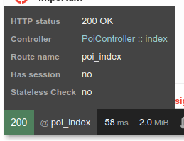

== Il menu

Finora abbiamo creato svariate pagine, ma il menu in spalla sinistra è ancora quello del template originale. Per correggere il menu, possiamo modificare il file *templates/partials/left-sidebar.html.twig*: aggiungiamo tre tag *_li_* all'inizio del tag *_ul.list_*, come segue:

[source,html]
----

  <ul class="list">
    <li class="header">MAIN NAVIGATION</li>
    <li>
      <a href="/map/empty">Plain map</a>
    </li>
    <li>
      <a href="/map/search">Map with search feature</a>
    </li>
    <li>
      <a href="/poi/">POI list</a>
    </li>
----

In questo modo avremo i link sempre a disposizione. +
Se però decidessimo di cambiare le rotte (modificando le annotazioni delle azioni nei ((Controller))), dovremmo riaprire questo file e modificarlo; cioè, ad es. se modificassimo l'annotazione *@Route("/map/empty", name="map_empty")* in *src/Controller/SuperController.php*, alterandone l'URL (*"/map/empty"*), dovremmo cambiare questo percorso nel template. +
Non è un lavorone (perché abbiamo solo un template che punta a questa pagina), ma possiamo evitare di doverci pensare usando la funzione Twig *path()* che <<symfony_twig_path,Symfony definisce in Twig>>:

[source,html]
----

  <ul class="list">
    <li class="header">MAIN NAVIGATION</li>
    <li>
      <a href="{{ path('map_empty') }}">Plain map</a>
    </li>
    <li>
      <a href="{{ path('map') }}">Map with search feature</a>
    </li>
    <li>
      <a href="{{ path('poi_index') }}">POI list</a>
    </li>
----

La funzione `path()` richiede come argomento il *_nome_* della rotta quindi, se lo cambiamo, dovremo comunque tornare a modificare questo template; però, nella mia esperienza non mi è successo quasi mai di _cambiare il nome_ di una rotta, mentre capita piuttosto spesso di modificarne l'URL. +

.Il nome della route è presente nella ((WDT))

