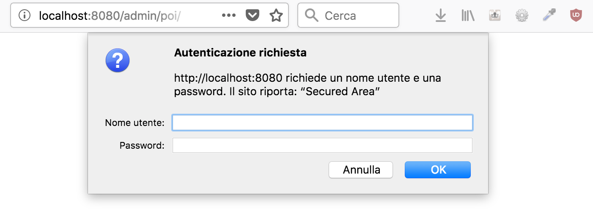
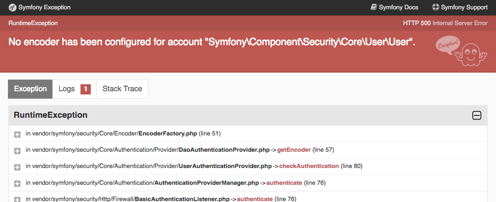
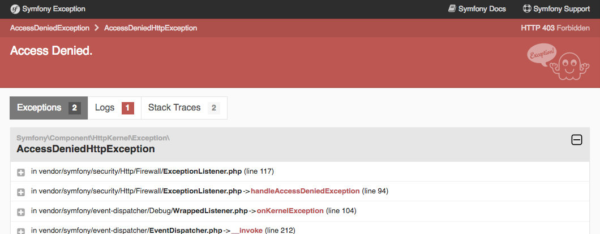
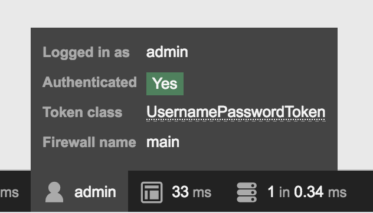
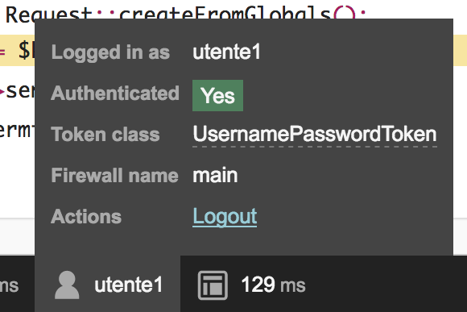

[#static_users]
== Utenti statici

Memorizzare gli account utente in un file di configurazione è il modo _più rapido_ e _meno versatile_ per gestire gli account utente in Symfony. +
Da un lato modificare gli account è un'operazione *rapida* e *sicura* (lo può fare solo chi accede ai file di configurazione), e niente viene registrato nel database; d'altro canto, con questo metodo gli utenti non potranno registrarsi autonomamente né modificare la propria password. Inoltre non è una soluzione scalabile: siccome tutti gli account vengono memorizzati nello stesso file di configurazione, quando cominciano a diventare tanti (qualche migliaio) la gestione può diventare difficoltosa. Detto ciò, questo metodo di memorizzazione rimane una via percorribile, anzi quella da preferire se il nostro progetto prevede pochi utenti/ruoli e non servono funzionalità evolute come la registrazione in self-service o il recupero della password. +
Abilitiamo ora la gestione statica degli utenti: apriamo il file *config/packages/security.yaml* e troviamo queste righe. (((security.yaml)))

[source,yaml]
.config/packages/security.yaml
----
    providers:
        users_in_memory: { memory: null }
----

Per definire *due account utente*, prima di tutto è necessario sostituire queste due righe con l'elenco degli utenti che vogliamo definire, in una sezione di nome *users*.

[source,yaml]
----
    providers:
        users_in_memory:
            memory:
                users:
                    utente1:
                        password: utente1Pass!
                        roles: 'ROLE_USER'
                    admin:
                        password: adminPass!
                        roles: 'ROLE_ADMIN'
----

Ora che abbiamo definito nomi, ruoli e password degli utenti, Symfony deve sapere _quale strategia_ utilizzare per l'autenticazione, e cercherà quest'informazione nella sezione *firewalls*.

[source,diff]
.config/packages/security.yaml
----
     firewalls:
         dev:
             pattern: ^/(_(profiler|wdt)|css|images|js)/
             security: false
         main:
-            anonymous: true
+            anonymous: ~
+            http_basic: ~
----

Le due righe aggiunte qui sopra significano che il firewall principale (main) _non_ è di tipo anonimo, ossia richiede l'autenticazione, e il modo in cui la richiede è l'autenticazione *HTTP basic*, quella gestita dal browser tramite una finestra di dialogo modale. +
Infine possiamo specificare _quali URL_ richiedono l'autenticazione,modificando la sezione *access_control* come segue.

[source,yaml]
----
    access_control:
        - { path: ^/admin/, roles: ROLE_ADMIN }
----

Quest'ultima modifica farà sì che, quando viene richiesto un URL che _inizia_ per */admin/*, Symfony chieda le credenziali e neghi l'accesso alla pagina (stato HTTP 401) a meno che non inseriamo le credenziali di un utente con ruolo _ROLE_ADMIN_; nel nostro caso ce n'è uno solo: l'utente *admin*. +
L'unico elemento che ci manca è, appunto, una pagina il cui URL cominci per */admin/*! +
Uno dei nostri ((Controller)) si presta a questo scopo: *PoiController*, quello che abbiamo creato con il comando `make:crud`, contiene le azioni di creazione/modifica dei *Poi*, che sarebbe bene eseguissero soltanto utenti autenticati, anzi solo gli _amministratori_ del sito. (((Come fare per...,Spostare tutti gli URL di un Controller)))

[TIP]
.Spostare *tutti* gli URL di un Controller
====
Quando abbiamo l'esigenza (come in questo caso) di cambiare il prefisso di *tutte* le rotte di un ((Controller)), possiamo aggiungere o modificare l'annotazione (((annotazione,@Route))) `@Route` appena *prima* della dichiarazione della classe Controller. In tal modo, tutte le rotte delle azioni del Controller verranno precedute dalla stringa che specificheremo. +
Ad es. se vogliamo che tutti gli URL di *PoiController* comincino per */admin/poi*, possiamo modificare l'annotazione @Route come segue:

[source,diff]
.src/Controller/PoiController.php
----
 /**
- * @Route("/poi")
+ * @Route("/admin/poi")
  */
 class PoiController extends Controller
 {
----
====

Ora possiamo provare l'autenticazione visitando la pagina http://localhost:8080/admin/poi/ . Dovrebbe comparire il _challenge_ HTTP classico, qualcosa di questo tipo.

Se inseriamo un nome utente diverso da `utente1` o `admin`, la pagina continuerà a chiederci le credenziali all'infinito; invece, se inseriamo credenziali corrette (quelle che abbiamo configurato nel file *config/packages/security.yaml*), il processo di autenticazione non andrà a buon fine perché si verificherà un'eccezione del tipo seguente.

Questo errore avviene perché la configurazione non è completa: Symfony a questo punto è in grado di caricare gli _utenti_ e le relative _password_, ma non sa ancora con *quale algoritmo* sono state codificate le password salvate. Questa informazione è fondamentale per riuscire a confrontare la password *ricevuta* (quella che l'utente ha _scritto_ nel form) con quella *salvata* nel db o nel file di configurazione, e quindi per riuscire ad autenticare gli utenti. +
Se per esempio memorizzassimo gli account utente *in un database*, e decidessimo di salvare le password _criptate_ utilizzando l'algoritmo SHA1, dovremmo dire a Symfony _in qualche modo_ che stiamo usando l'algoritmo SHA1 per criptare le password. +
Questo '_in qualche modo_' è la voce di configurazione *security.encoders*: si tratta di un hash in cui la chiave è il percorso della *classe PHP associata all'utente*, e il valore è il nome dell'algoritmo di codifica delle password utilizzato da quella classe utente. +
Nel nostro caso:

. stiamo usando il provider *users_in_memory*;
. questo restituisce oggetti della classe *Symfony\Component\Security\Core\User\User*, come abbiamo potuto apprendere dal messaggio di errore;
. nel file di configurazione abbiamo scritto le password *in chiaro*: se non usiamo alcun algoritmo di codifica, nella voce di *security.encoders* dovremo scrivere *plaintext*.

Per risolvere l'errore "No encoder has been configured ...", aggiungiamo queste righe a *config/security.yaml*:

[source,yaml]
----
security:
    # ...
    # 'encoders' deve essere _figlio_ di 'security'
    encoders:
        Symfony\Component\Security\Core\User\User: plaintext
----

Per verificare di non avere _falsi positivi_ (accesso consentito anche a chi non dovrebbe accedere), proviamo ora ad inserire credenziali *non valide* nel *challenge* http://localhost:8080/admin/poi/ : il browser chiederà nuovamente le credenziali, in quanto l'autenticazione non va a buon fine. Inseriamo ora credenziali *valide*, cioè nome utente `utente1` e password `utente1Pass!`. Otterremo questo:

.Perché ci viene negato l'accesso?

Ricordate quando abbiamo detto a Symfony che le route che iniziano per `/admin/` sono accessibili solo a utenti con il ruolo *ROLE_ADMIN* ? Precisamente quando abbiamo scritto queste righe in *config/pagkages/seurity.yaml*:

[source,yaml]
----
    access_control:
        - { path: ^/admin/, roles: ROLE_ADMIN }
----

L'utente *utente1* non ha il ruolo *ROLE_ADMIN* per cui, nonostante si sia *autenticato* correttamente, non passa l'esame del controllo di accesso: in altri termini è *autenticato* ma non è *autorizzato* a vedere questa pagina. +
Siccome l'autenticazione è andata a buon fine, Symfony ha memorizzato le credenziali dell'utente nella _sessione_ (gestita tramite cookie): per cambiare utente dovremmo fare "log out", ma non è possibile farlo agevolmente: usando il metodo di autenticazione HTTP Basic, una volta autenticati, il browser invia l'header HTTP "Authorization: Basic ..." ad ogni richiesta, e per annullare questo comportamento via codice l'unico modo per fare logout è *cancellare il cookie di sessione* (eliminare i cookie del browser) oppure aprire una nuova *finestra di navigazione anonima*. +
Dopo aver cancellato i cookie, o aperto una nuova finestra anonima, carichiamo nuovamente la pagina e Symfony richiederà le credenziali; inseriamo nome utente `admin` e password `adminPass!` e ci verrà consentito l'accesso: questo ci è confermato sia dal fatto che la pagina con l'elenco dei _POI_ viene visualizzata correttamente icon:smile-o[] sia dal fatto che nella ((WDT)) compare il nome utente (*admin*) che abbiamo inserito:

[.text-center]

(((Come fare per..., Creare un form di login)))
== Usiamo un form per il login

Come abbiamo visto, il metodo di autenticazione _HTTP Basic_ ha un problema: è impossibile fare logout... non è un problema da poco. 

.Impossible is nothing
[NOTE]
====
Fare logout non è _realmente_ impossible, solo che per farlo dovremmo scrivere un'azione _ad hoc_ (in un ((Controller))) nella quale distruggere la sessione corrente: questo esula dalla gestione dell'autenticazione integrata in Symfony, di cui ci stiamo occupando.
====

Per ovviare al problema del logout, possiamo far autenticare i nostri utenti in un modo diverso, cioè tramite il classico _form_ HTML; per farlo, modifichiamo per prima cosa il file *config/packages/security.yaml* come segue:

[source,diff]
.config/packages/security.yaml
----
     firewalls:
         # ...
         main:
             anonymous: ~
-            http_basic: ~
+            form_login:
+                login_path: login
+                check_path: login
----

=== Azione e form

Con le righe aggiunte a *security.yaml* abbiamo detto a Symfony che la _rotta_ `login` contiene il form di autenticazione, ma non è _ancora_ così: prima dobbiamo creare un'azione e associarle la rotta `login`. Aggiungiamo dunque il relativo metodo in *src/Controller/SuperController.php*, come segue.

[source,php]
----
/**
 * @Route("/login", name="login")
 */
public function login()
{
  return $this->render('login.html.twig');
}
----

Quindi ci servirà il file template *templates/login.html.twig*: useremo come base di partenza la pagina di _{template_name}_ che si trova in http://localhost:8081/pages/examples/sign-in.html[pages/examples/sign-in.html]. Se la confrontiamo con il template *templates/base.html.twig*, noteremo che in *sign-in.html*:

. viene caricato un CSS in meno (*/css/themes/theme-brown.min.css*);
. il tag *<body>* ha una classe CSS diversa;
. vengono caricati un JS in meno (*bootstrap-select.js*) e uno in più (*jquery.validate.js*);
. *soprattutto*, il corpo della pagina ha una struttura diversa.

Per evitare complicazioni superflue, è preferibile creare per questa pagina un template indipendente da *base.html.twig*, seguendo gli stessi passi del capitolo <<cambiamo-il-template-base>>. +
Anzitutto copiamo la pagina del template nel nostro progetto Symfony, col nome *templates/login.html.twig*.

[source,bash]
----
cd sample_symfony
cp html_template/pages/examples/sign-in.html guybrush/templates/login.html.twig 
----

Sostituiamo il titolo della pagina con il blocco Twig di nome `title`:

[source,diff]
.templates/login.html.twig
----
 <head>
    <meta charset="UTF-8">
    <meta content="width=device-width, initial-scale=1, maximum-scale=1, user-scalable=no" name="viewport">
-    <title>Sign In | Bootstrap Based Admin Template - Material Design</title> <1>
+    <title>Sign in</title>
----

Poi, come abbiamo fatto per il template *base.html.twig*, rimpiazziamo tutte le occorrenze di `href="../../` con `href="/` (*attenzione*: le virgolette vanno scritte solo una volta, dopo `href=`), e tutte le occorrenze di `src="../../` con `src="/` . +
Se ora proviamo a caricare la pagina http://localhost:8080/login, all'apparenza dovrebbe essere identica all'originale.
//
// @todo: Siamo sicuri di non voler includere nel corso la registrazione e il forgot password?!?
//
// Nel nostro sito però non prevediamo di far registrare gli utenti, nè la funzione "Forgot password": troviamo quindi queste righe:
//
// [source,html]
// ----
//   

//     

//       <a href="sign-up.html">Register Now!</a>
//     

//     

//       <a href="forgot-password.html">Forgot Password?</a>
//     

//   

// ----
//
// e cancelliamole facendo attenzione a non "spezzare" i tag `
`. +

Se vogliamo cambiare il logo possiamo fare qualcosa del genere.

[source,diff]
----
   

-    <a href="javascript:void(0);">Admin<b>BSB</b>
+    <a href="/">Guybrush
     </a>
-    <small>Admin BootStrap Based - Material Design</small>
+    <small>A nice store finder :)</small>
   

----

Per rendere funzionante il form di login, ci basterà:

- aggiungere l'attributo `action` al tag `form`;
- cambiare l'attributo `name` dell'input user da `username` a `_username`;
- cambiare l'attributo `name` dell'input password da `password` a `_password`.

[source,diff]
.templates/login.html.twig
----
-<form id="sign_in" method="POST">
+<form id="sign_in" method="POST" action="{{ path('login') }}">
   
Sign in to start your session

   

     
       <i class="material-icons">person</i>
     
     

-      <input type="text" class="form-control" name="username" placeholder="Username" required autofocus>
+      <input type="text" class="form-control" name="_username" placeholder="Username" required autofocus>
     

   

   

     
       <i class="material-icons">lock</i>
     
     

-      <input type="password" class="form-control" name="password" placeholder="Password" required>
+      <input type="password" class="form-control" name="_password" placeholder="Password" required>
     

   

  ...
</form>
----

A questo punto il form di login è operativo: per vederlo in funzione, cancelliamo ancora una volta i cookie (o apriamo una nouva finestra di navigazione anonima) e visitiamo... *non* la pagina login, ma quella di prima: http://localhost:8080/admin/poi/ . +
Stavolta verremo rediretti automaticamente alla nostra pagina di login e, se inseriamo credenziali valide, Symfony ci farà tornare a questa pagina.

== Logout

Adesso che usiamo un form per l'autenticazione, possiamo finalmente effettuare il logout senza dover cancellare la cache e i cookie. Tutto quel che serve è specificare l'URL della pagina di logout in *config/packages/security.yaml* e *config/routes.yaml*.

[source,yaml]
.config/packages/security.yaml
----
    firewalls:
        # ...
        main:
            # ...
            logout:
                path: /logout
----

[source,yaml]
.config/routes.yaml
----
logout:
    path: /logout
----

NOTE: La rotta configurata per il logout (nel nostro caso */logout*) è un URL particolare, per il quale non è necessario specificare un Controller in *config/routes.yaml*. Symfony si arrangia a capire che non si tratta di un'anomalia.

Una volta salvati questi due file, proviamo a ricaricare la pagina e vedremo comparire il link Logout nella ((WDT)):

[.text-center]

Verifichiamo che funzioni cliccandolo: dovrebbe riportarci alla homepage, ossia al valore specificato come *target* in *security.yaml*. (((Come fare per..., Redirigere dopo il logout)))

.Redirigere a una pagina specifica dopo il logout

Se desideriamo che dopo il logout gli utenti vengano rediretti ad una pagina diversa dalla homepage (`/`), possiamo specificare un URL differente alla voce *logout.target* del firewall relativo; ad es. per redirigere alla pagina `login`:

[source,yaml]
.config/packages/security.yaml
----
  firewalls:
      # ...
      main:
          # ...
          logout:
                path: /logout
                target: /login
----

<<<
