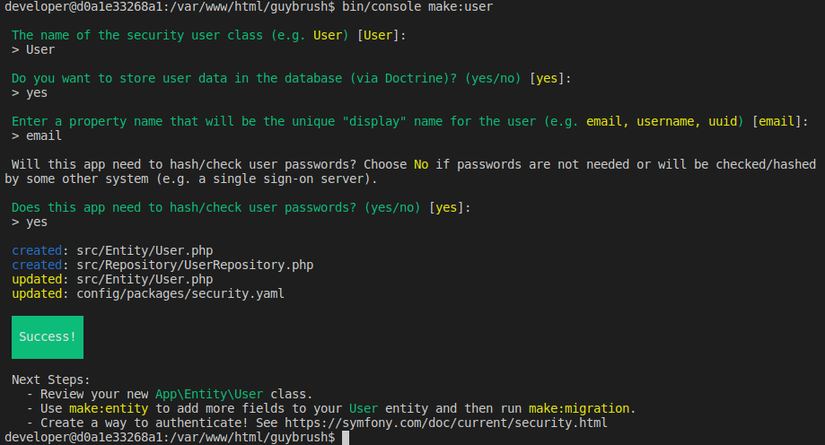

== Utenti dinamici

// ****
// .icon:github[] Con il repository {sample_git_repo_web}

// Per tornare a questo punto del corso potete fare checkout del tag *0.8.0-static_users*. (((Git, git checkout)))

// [source,bash]
// ----
// cd /percorso/di/guybrush        # sostituite col percorso corretto
// git checkout -b work 0.8.0-static_users
// ----

// ****

Per rendere scalabile la gestione degli utenti è consigliabile salvare gli account in una *tabella di database*; inoltre, solo così è possibile implementare caratteristiche aggiuntive, come ad es. permettere agli utenti di _creare il proprio account_ in autonomia, dar loro la possibilità di _cambiare password_, oppure semplicemente gestire un vero e proprio _profilo_ utente; con la soluzione vista nel capitolo precedente, infatti, ciascun _account_ non ha nulla più che un nome utente e una password. +
Quando ho iniziato a scrivere questo corso, per gestire dinamicamente gli utenti in Symfony era consigliabile usare il pacchetto *((FOSUserBundle))*; tuttavia, il fatto che non sia più mantenuto, la sua incompatibilità con Symfony 5.2, e un post sull'argomento footnote:fos[https://jolicode.github.io/fosuserbundle-conf/ L'autore del post sostiene che al giorno d'oggi utilizzare FOSUserBundle crea più ostacoli che vantaggi... e mi trova d'accordo.], mi hanno convinto a prendere un'altra strada.

NOTE: _FOSUserBundle_ è compatibile con le versioni di Symfony fino alla *5.1* inclusa: se state usando una versione di Symfony compatibile e volete provare a utilizzarlo, trovate le istruzioni per installarlo nell'appendice <<fosuserbundle>>.

=== Costruiamo la nostra classe utente

Per memorizzare gli account utente useremo ora una tabella del DB, e per interagire con questa tabella Symfony utilizzerà ((Doctrine)); quindi, come abbiamo visto in precedenza, ci servirà una classe _((Entity))_ che rappresenti gli _account utente_. +
Per creare questa _Entity_ stavolta non useremo il comando `make:entity` come in altre occasioni, bensì `make:user`: questo comando non si limita a creare la _Entity_, ma ne imposta correttamente la classe madre, crea alcuni metodi aggiuntivi e modifica opportunamente il file *security.yaml* che abbiamo incontrato nel capitolo precedente. Possiamo provarlo subito, sempre da una shell del container *guybrush_php8*:

[source,bash]
----
su developer
cd /var/www/html/guybrush
bin/console make:user
----

Il comando pone alcune domande, e per facilitarci il compito propone risposte predefinite: nel nostro caso, possiamo accettare i valori di default senza problemi.

// [source]
// ----
// $ bin/console make:user

//  The name of the security user class (e.g. User) [User]:
//  > User

//  Do you want to store user data in the database (via Doctrine)? (yes/no) [yes]:
//  > yes

//  Enter a property name that will be the unique "display" name for the user (e.g. email, username, uuid) [email]:
//  > email

//  Will this app need to hash/check user passwords? Choose No if passwords are not needed or will be checked/hashed by some other system (e.g. a single sign-on server).

//  Does this app need to hash/check user passwords? (yes/no) [yes]:
//  > yes

//  created: src/Entity/User.php
//  created: src/Repository/UserRepository.php
//  updated: src/Entity/User.php
//  updated: config/packages/security.yaml

           
//   Success! 
           

//  Next Steps:
//    - Review your new App\Entity\User class.
//    - Use make:entity to add more fields to your User entity and then run make:migration.
//    - Create a way to authenticate! See https://symfony.com/doc/current/security.html
// ----

Quando il comando ha completato la sua esecuzione, possiamo personalizare la _Entity_ User aggiungendovi alcuni campi (di suo, infatti, parte con i soli *nome utente* e *password*); in questo caso il comando `make:entity User` farà al caso nostro. Nel resto del corso useremo i campi seguenti, ma potete aggiungerne altri a piacere:

 - nome completo (`fullName`);
 - data di creazione (`createdAt`), popolata in automatico grazie all'estensione <<timestampable_field,_Timestampable_>>;
 - data di modifica (`updatedAt`), popolata in automatico grazie all'estensione _Timestampable_.

Una volta aggiunti alla _Entity_ *User* i campi che desideriamo, dovremo creare ed eseguire una migrazione di database, come ci consigliava il comando `make:user`: in tal modo nel database sarà presente la tabella per le Entity User e il sistema sarà pronto per l'uso. +
Come si trova scritto nei libri scolastici, lascio come utile esercizio al lettore il compito di aggiungere i campi alla _Entity_ ed effettuare la migrazione di DB, tenendo presente che ai campi *createdAt* e *updatedAt* andranno aggiunte le annotazioni `@Gedmo\Timestampable(on="...")`.

=== Non funziona più il form di login!

Se adesso proviamo a fare login dalla pagina <http://localhost:8080/login>, noteremo che gli account statici che usavamo prima _non funzionano più_; ora infatti Symfony _cerca_ gli utenti usando un _provider_ differente rispetto a prima. Perché? +
Come accennato sopra, il comando `make:user` ha modificato -fra le altre cose- il file *((security.yaml))*, nello specifico la voce `security.firewalls.main.provider`.

[source,yaml]
./config/packages/security.yaml
----
security:
    providers:
        # used to reload user from session & other features (e.g. switch_user)
        app_user_provider: <1>
            entity:
                class: App\Entity\User
                property: email
    firewalls:
        dev:
            # ...
        main:
            anonymous: ~
            form_login:
                login_path: login
                check_path: login
            lazy: true
            provider: app_user_provider <2>
----

<1> Il comando ha sostituito il _provider_ `users_in_memory`, che abbiamo creato nel capitolo <<static_users>>, con un nuovo _provider_ di nome `app_user_provider` che recupera gli utenti usando *Doctrine* e usa il campo _email_ come username.
<2> Il comando ha associato il nuovo provider al form di login.

Per questi due motivi gli account che avevamo definito nel capitolo <<static_users>> non sono più accessibili; quindi, non è proprio vero che il form non funziona più, semplicemente cerca gli utenti dove non li può trovare (in una tabella di database che è ancora vuota). In questo momento perciò non siamo più in grado di autenticarci: niente paura, stiamo per creare un *form di registrazione* che ci permetterà di creare il nostro account utente.

[NOTE]
.E la gestione dei *Poi*?
====
Per i motivi appena visti, la pagina di gestione dei Poi footnote:poi[Pagina di gestione dei *Poi*: http://localhost:8080/admin/poi/] non è più accessibile: restituisce uno stato HTTP 403 (_forbidden_). Se volete tornare ad accedervi senza autenticazione, è sufficiente _aprire_ il firewall commentando la riga relativa in *((security.yaml))*, come segue.

[source,yaml]
----
    access_control:
        # - { path: ^/admin, roles: ROLE_ADMIN }
----

====

<<<