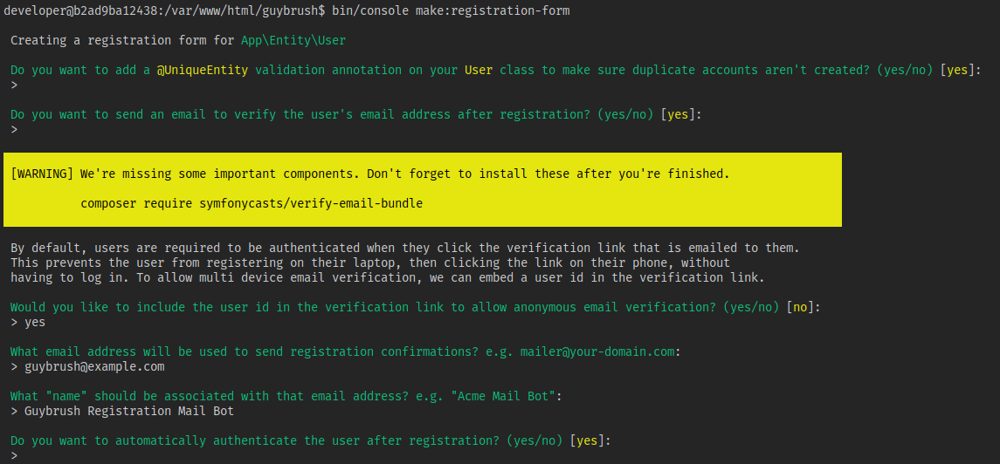
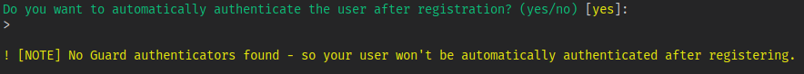
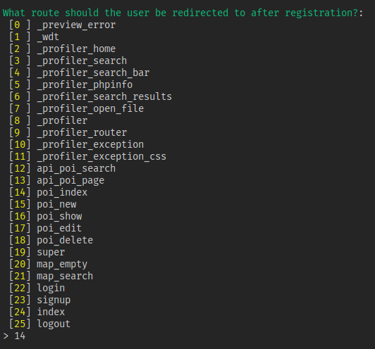
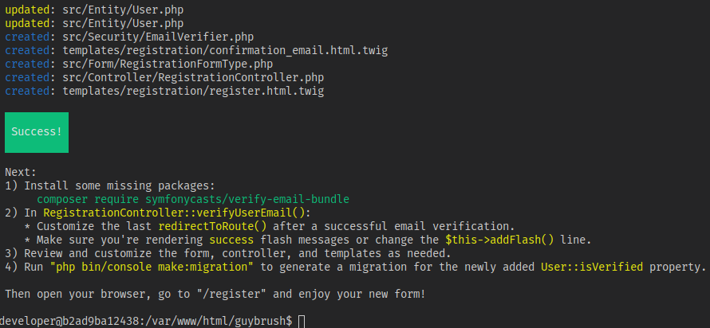
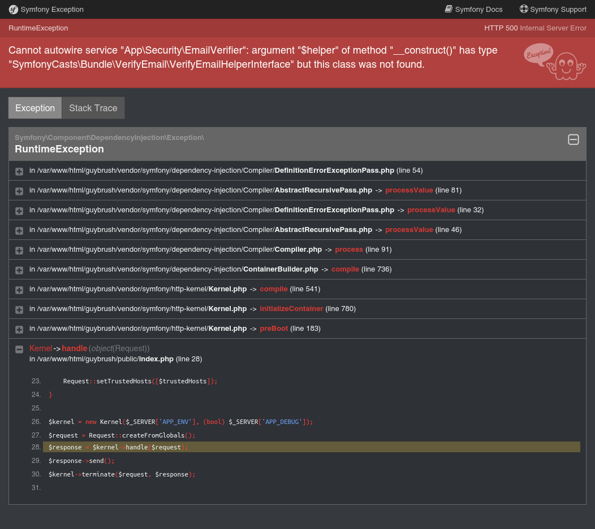
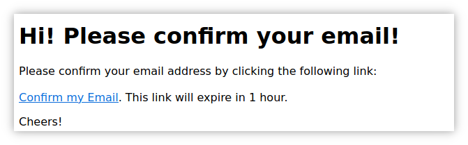
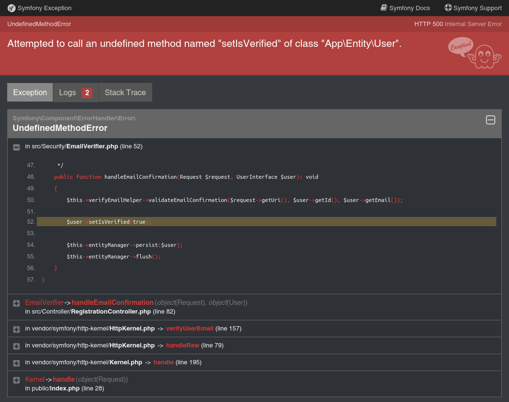
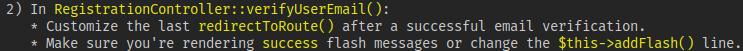

[#registrazione]
== Creiamo un form di registrazione

****
.icon:github[] Con il repository {sample_git_repo_web}

Per tornare a questo punto del corso potete fare checkout del tag *0.9.0-dynamic-users*. (((Git, git checkout)))

[source,bash]
----
cd /percorso/di/guybrush        # sostituite col percorso corretto
git checkout -b work 0.10.0-reg-base
----

****

Per creare un form che permetta ai visitatori di iscriversi al sito, Symfony mette a disposizione un comando molto potente: `make:registration-form`. Possiamo vedere quante operazioni permette di effettuare questo comando, lanciandolo come segue (sempre da una shell del container *guybrush_php8*):

.Attenzione al messaggio in giallo

.Quando un utente si logga, portiamolo alla pagina di amministrazione dei POI

Il messaggio `Warning: ...` che compare dopo la prima domanda significa che, dopo l'esecuzione del comando, l'applicazione si trova in uno stato incoerente, perché utilizza classi di un pacchetto non installato (`symfonycasts/verify-email-bundle`). Se visitiamo una qualsiasi pagina, infatti, otteniamo questo errore.

.Dopo make:registration-bundle, manca il pacchetto symfonycasts/verify-email-bundle

Installiamo dunque il pacchetto richiesto nel solito modo.

[source,bash]
----
su developer
cd /var/www/html/guybrush
composer require symfonycasts/verify-email-bundle --ignore-platform-reqs
----

Ora la pagina di registrazione <http://localhost:8080/register> non funzionerà ancora, ma per un motivo diverso: a Symfony manca la configurazione del *metodo da usare* per inviare email; per questo v. l'appendice <<inviare_email>>.

[#registrazione_mail_config_ok]
Una volta completata la configurazione di Symfony per l'invio di email,  l'URL <http://localhost:8080/register> non mostrerà più messaggi di errore, ma ci permetterà di registrarci inserendo un indirizzo email e una password e, se inseriamo un indirizzo esistente, riceveremo un'email contenente un link da usare per verificare il nostro account, il che è già un ottimo risultato!

.Il messaggio email di default per confermare la nostra registrazione

Manca ancora un tassello perché il tutto funzioni senza problemi: il link di conferma contenuto nel messaggio email, infatti, pur puntando alla pagina corretta, genera un errore perché il metodo *\App\Security\EmailVerifier::handleEmailConfirmation()* invoca  `$user->setIsVerified(true);`, ossia un metodo che non esiste nella classe _User_!

Ovviare al problema non è difficile. Occorre, nell'ordine:

. aggiungere alla Entity _User_ un campo booleano di nome *isVerified* (si può usare `bin/console make:entity User` come spiegato nell'appendice <<doctrine_aggiungere_campi>>);
. impostare `false` come valore di default del campo (come spiegato nell'<<doctrine_default_constructor,appendice su Doctrine>>);
. creare ed eseguire una migrazione di database (come spiegato nel paragrafo <<makemigration>>). 

NOTE: La migrazione fallirà se la tabella *user* contiene record, perché il database non sa come valorizzare il campo *isVerified*; prima di eseguirla bisogna quindi *svuotare* la tabella *user* con la query `TRUNCATE TABLE "user";`.

Arrivati a questo punto, funzionano sia il processo di registrazione (cioè la creazione del record User a database), sia quello di *verifica tramite email*: potete verificarlo di persona. Alla fine del processo di verifica, però, verrete rediretti nuovamente alla pagina di registrazione. Perché? +
Se vi ricordate, quando abbiamo creato il form di registrazione, il comando riportava un elenco delle _prossime cose da fare_, fra cui:

Questo punto si riferisce al metodo/rotta *verifyUserEmail()* nel controller *RegistrationController*, e nello specifico a queste righe:

[source, php]
----
class RegistrationController extends AbstractController {
    // ...

    #[Route('/verify/email', name: 'app_verify_email')]
    public function verifyUserEmail(Request $request, UserRepository $userRepository): Response
    {
        // ...

        // @TODO Change the redirect on success and handle or remove the flash message in your templates
        $this->addFlash('success', 'Your email address has been verified.'); // <1>

        return $this->redirectToRoute('app_register'); // <2>
    }
}
----

<1> Il controller qui imposta un _flash message_ footnote:flash[I _flash message_ di Symfony sono documentati alla pagina https://symfony.com/doc/current/components/http_foundation/sessions.html#flash-messages .] per rendere noto che la verifica dell'email è andata a buon fine. Lo stesso _flash message_ dovrebbe essere mostrato nella pagina a cui redirige la riga successiva. V. il prossimo paragrafo per ulteriori informazioni.

<2> Per default l'azione di verifica dell'email riporta alla pagina di registrazione, ma questo comportamento non è molto utile. Piuttosto che registrarsi nuovamente, un utente verificato potrebbe volersi autenticare.

[source, diff]
.Cambiamo l'istruzione redirectToRoute()
----
 class RegistrationController extends AbstractController {

     // ...
 
     #[Route('/verify/email', name: 'app_verify_email')]
     public function verifyUserEmail(Request $request, UserRepository $userRepository): Response
     {
         // ...

         // @TODO Change the redirect on success and handle or remove the flash message in your templates
         $this->addFlash('success', 'Your email address has been verified.');

-        return $this->redirectToRoute('app_register');
+        return $this->redirectToRoute('login');
     }
 }
----

== Digressione: flash message

Ora che le parti importanti sono smarcate, ci prendiamo un attimo per dedicarci al lato estetico dell'applicazione. In questa sezione faremo in modo che il template della pagina di _login_ mostri eventuali messaggi, di errore o informativi, impostati dalla *pagina da cui proveniamo*. +
Per gestire messaggi di questo tipo Symfony usa quelli che chiama _flash messages_, che non sono altro che stringhe a cui è possibile associare un _tipo_ (ad esempio, `error` per gli errori), salvate nella sessione PHP. Per evitare notifiche multiple, quando un flash message viene letto, viene anche eliminato dalla sessione. +
Nel paragrafo precedente abbiamo visto che l'azione che verifica l'indirizzo email di un utente appena registrato imposta un _flash message_ prima di redirigere alla pagina di login, ma quest'ultima -al momento- ignora il messaggio e mostra solamente il form di autenticazione; per mostrare i _flash message_, procediamo come segue. +
Apriamo *templates/login.html.twig* nel nostro IDE, e aggiungiamo un `div` di questo tipo prima del `
`. Questa non è la stesura definitiva, serve solo per vedere come sono fatti i messaggi che restituisce la funzione `app.flashes()` footnote:app_var[La variabile globale `app` in Twig ha anche altri elementi utili oltre a `flashes()`: è documentata alla pagina <https://symfony.com/doc/current/templates#twig-app-variable> .].

[source, html]
.templates/login.html.twig
----
  ...

  
  

    <code>{{ flashes | json_encode }}</code>
  

  

    ...
----

Questo ci consentirà di vedere _come_ sono fatti i messaggi che la funzione restituisce, ma per ora probabilmente la pagina di login *non ne mostrerà nessuno* (perché nessun'altra pagina ne ha impostati in precedenza). Sempre per provare, possiamo impostarne alcuni nell'azione di login, come segue:

[source, diff]
.src/Controller/SuperController.php
----
    #[Route("/login", name:"login")]
-    public function login(): Response
+    public function login(\Symfony\Component\HttpFoundation\Session\Session $session): Response
    {
+        $session->getFlashBag()->add('danger', 'Messaggio di pericolo');
+        $session->getFlashBag()->add('warning', 'Messaggio di allerta');
+        $session->getFlashBag()->add('notice', 'Messaggio di notifica');
+        $session->getFlashBag()->add('success', 'Evviva!');
+        $session->getFlashBag()->add('success', 'Un altro messaggio di successo...');
+
        return $this->render('login.html.twig');
    }
----

Ora visitando la pagina http://localhost:8080/login comparirà qualcosa del genere sopra il form:

[source, json]
----
{
 "danger":["Messaggio di pericolo"],
 "warning":["Messaggio di allerta"],
 "info":["Messaggio di notifica"],
 "success":["Evviva!","Un altro messaggio di successo..."]
}
----

Deduciamo che `app.flashes()` restituisce un array associativo, in cui la *chiave* è il _tipo_ del messaggio flash, e il *valore* è a sua volta un _array di tutti i messaggi_ di quel tipo; modifichiamo il template per visualizzarli con un po' più di stile.

[source, html]
.templates/login.html.twig
----
  ...

  
    
      

        {{ flash }}
      

    
  

  

    ...
----

Adesso i `div` compaiono colorati, perché il foglio di stile del template contiene le seguenti classi:

- *alert-success*: verde
- *alert-info*: azzurro
- *alert-warning*: giallo
- *alert-danger*: rosso

=== Bonus/Esercizio

Possiamo migliorare ulteriormente l'aspetto della pagina con alcune accortezze (la realizzazione è lasciata come esercizio). +

. Rendere gli alert _dismissible_, ossia fare in modo che si possano chiudere footnote:dismissible[Il codice HTML per rendere _chiudibili_ gli alert si può trovare nel sorgente della pagina http://localhost:8081/pages/ui/alerts.html .].

. Animare gli alert usando il plugin *animate-css* footnote:animate-css[La pagina relativa al plugin *animate-css* è disponibile all'URL http://localhost:8081/pages/ui/animations.html .].

IMPORTANT: Alla fine dell'esercizio, o se non avete voglia di farlo, ricordatevi di cancellare le istruzioni `$session->getFlashBag()->add()` dall'azione *login()*: le avevamo aggiunte solo per provare a visualizzare messaggi!

<<<
