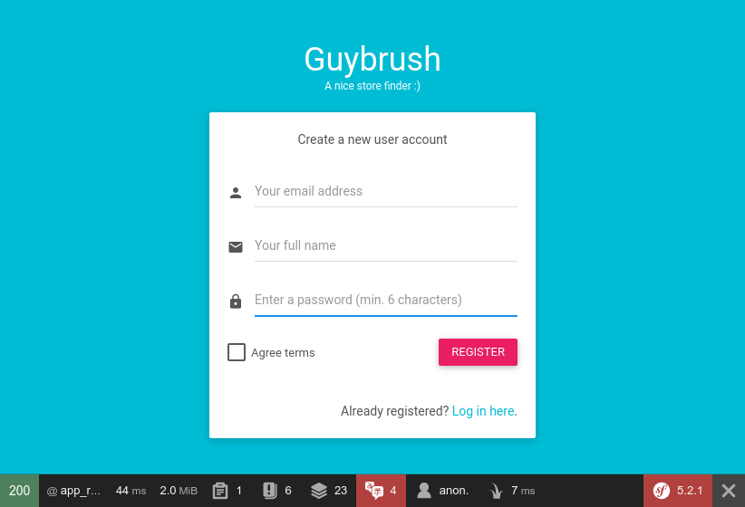
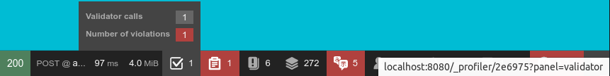

== Arricchiamo il form di registrazione

****
.icon:github[] Con il repository {sample_git_repo_web}

Per tornare a questo punto del libro potete fare checkout del tag *0.10.0-reg-base*. (((Git, git checkout)))

[source,bash]
----
cd /percorso/di/guybrush        # sostituite col percorso corretto
git checkout -b work 0.10.0-reg-base
----

****

A questo punto del corso, il form di registrazione è operativo e consente la verifica del proprio account inviando un messaggio email. Niente male! +
Alcuni aspetti però meritano ancora la nostra attenzione:

. al login, gli utenti vengono portati alla pagina *admin/poi*, che fallisce con codice HTTP 403 perché ai nuovi utenti manca il ruolo ROLE_ADMIN (per inciso, ai nuovi utenti manca *qualsiasi* ruolo). Potremmo ovviare "aprendo" i permessi della pagina a chiunque, ma questo renderebbe inutile la gestione degli utenti; oppure, possiamo assegnare di default un ruolo ai nuovi utenti, e fare in modo che la pagina *admin/poi* sia accessibile a quel ruolo.

. il form di registrazione permette di inserire solo il proprio indirizzo email, ma la ((Entity)) _User_ ha anche un attributo *fullName* che avevamo aggiunto per memorizzare il nome completo degli utenti: sarebbe opportuno includere questo campo (opzionale) nel form di registrazione.

. le pagine di registrazione e di login hanno stili molto diversi (quella di registrazione eredita il template base): probabilmente ha più senso usare lo stesso stile per entrambe.

=== Template unico

Nel template HTML _{template_name}_ esiste un modello di pagina di registrazione (nell'infrastruttura _((Docker))_ del progetto, è visibile all'URL http://localhost:8081/pages/examples/sign-up.html). Potremmo copiarlo in */templates* e modificarlo per le nostre esigenze, ma siccome è visibilmente molto simile al template di login, seguiamo il principio *((DRY))* (acronimo di *Don't Repeat Yourself*), evitiamo di avere doppioni noiosi da mantenere, e creiamo un template base unico per _login_ e _signup_.
Copiamo il contenuto di */templates/login.html.twig* in un nuovo file (lo chiameremo */templates/single-form.html.twig*.), e rimpiazziamo il tag `<form>` con un blocco ((Twig)) vuoto, di nome `content`. Alla fine il template dovrebbe somigliare a questo:

[source,html]
./templates/single-form.html.twig
----
<!DOCTYPE html>
<html>
<head>
  <meta charset="UTF-8">
  <meta content="width=device-width, initial-scale=1, maximum-scale=1, user-scalable=no" name="viewport">
  <title>Sign in</title>
  <!-- Favicon-->
  <link rel="icon" href="favicon.ico" type="image/x-icon">
  <!-- Google Fonts -->
  <link href="https://fonts.googleapis.com/css?family=Roboto:400,700&subset=latin,cyrillic-ext" rel="stylesheet"
        type="text/css">
  <link href="https://fonts.googleapis.com/icon?family=Material+Icons" rel="stylesheet" type="text/css">
  <!-- Bootstrap Core Css -->
  <link href="plugins/bootstrap/css/bootstrap.css" rel="stylesheet">
  <!-- Waves Effect Css -->
  <link href="plugins/node-waves/waves.css" rel="stylesheet"/>
  <!-- Animation Css -->
  <link href="plugins/animate-css/animate.css" rel="stylesheet"/>
  <!-- Custom Css -->
  <link href="css/style.css" rel="stylesheet">
</head>

<body class="login-page"> <1>

  

    <a href="/">Guybrush</a>
    <small>A nice store finder :)</small>
  

  
    
      

        {{ flash }}
        <button type="button" class="close" data-dismiss="alert" aria-label="Close">&times;</button>
      

    
  

  

    

      
      
    

  

<!-- Jquery Core Js -->

<!-- Bootstrap Core Js -->

<!-- Waves Effect Plugin Js -->

<!-- Validation Plugin Js -->

<!-- Custom Js -->

 <2>

</body>
</html>
----

<1> Le classi CSS di questo `div` e del suo primo figlio sono legate alla pagina di login: siccome questo template avrà diversi figli, è possibile rendere dinamiche queste classi, ma per il momento non abbiamo quest'esigenza.

<2> In questo blocco possiamo inserire lo script JS relativo alla pagina di login (/js/pages/examples/sign-in.js) o codice JS custom.

Ora possiamo semplificare sia */templates/login.html.twig* che */templates/registration/register.html.twig*. All'inizio di *login.html.twig* inseriremo una direttiva `extends`, manterremo solo il tag `form` come contenuto del blocco `content`, e il tag `script` relativo a *sign-in.js* nel blocco `custom_js`. Il blocco di nome `title` farà da titolo della pagina. +
Nella pagina *register* vanno apportate modifiche più sostanziose: meglio vedere subito il risultato finale.

[source, html]
./templates/registration/register.html.twig
----
 <1>

Register

 <2>

  {{ form_start(registrationForm) }}
  
Create a new user account

  
 <3>
      
          <i class="material-icons">person</i>
      
    

      {{ form_widget(registrationForm.email) }}
    

  

  

      
          <i class="material-icons">mail</i>
      
    

      {{ form_widget(registrationForm.fullName) }}
    

  

  

      
          <i class="material-icons">lock</i>
      
    

      {{ form_widget(registrationForm.plainPassword, {
        attr:{class: 'form-control'}
        }) }}
    

  

  

    

      {{ form_widget(registrationForm.agreeTerms, {
        attr:{class:'filled-in chk-col-pink'}
        }) }}
    

    

      <button class="btn btn-block bg-pink waves-effect" type="submit">REGISTER</button>
    

  

  {{ form_end(registrationForm) }}

  

    

      Already registered? <a href="{{ url('login') }}">Log in here</a>. <4>
    

  


----

<1> Il tag `extends` va aggiornato.
<2> Il blocco `content` precedentemente si chiamava `body`.
<3> (((Come fare per...,Personalizzare il rendering dei form))) Questo è un esempio di come sia possibile personalizzare l'aspetto dei campi nei form di Symfony, _spezzando_ la chiamata alla funzione Twig `form_row()` in `form_label()`, che qui non utilizziamo, e `form_widget()`. Per ulteriori informazioni v. la documentazione ufficiale footnote:form_customizations[How to Customize Form Rendering https://symfony.com/doc/current/form/form_customization.html].
<4> Facciamo un favore agli utenti distratti: permettiamo di passare dal form di registrazione a quello di login. Nota: facciamo l'opposto nel form di login.

Affinché questa pagina funzioni correttamente, dobbiamo apportare alcuni aggiustamenti al form *RegistrationFormType*: è necessario aggiungere il campo *fullName* e modificare leggermente le opzioni di campi *email* e *plainPassword*, in modo che nella pagina compaiano gli opportuni _placeholder_ all'interno dei campi di input.

[source, diff]
----
 class RegistrationFormType extends AbstractType
 {
     public function buildForm(FormBuilderInterface $builder, array $options)
     {
         $builder
-             ->add('email')
+             ->add('email', null, [
+             'attr' => ['placeholder'=>'Your email address']
+             ] )
+             ->add( 'fullName', null, [
+             'required' => false,
+             'attr' => ['placeholder'=>'Your full name']
+             ])
             ->add('plainPassword', PasswordType::class, [
                 // ...
+                'attr' => ['placeholder'=>'Enter a password (min. 6 characters)']
             ])
         ;
     }
     // ...
 }
----

Adesso l'URL <http://localhost:8080/register> dovrebbe mostrare qualcosa di simile.

== Gestione degli errori

Prima di passare al capitolo successivo, abbiamo un'ultima questione da sistemare: il form di registrazione non mostra nessun messaggio di errore se ad es. cerchiamo di registrarci con un indirizzo email già salvato. L'unico indizio che avremo in tal caso sarà un messaggio nella ((WDT)), ma niente nel markup del form farà capire che qualcosa è andato storto: semplicemente, Symfony ci riporterà alla pagina di registrazione.

.Registrandoci due volte con la stessa email la pagina non va in errore.

La soluzione viene dalla stessa pagina della documentazione footnote:form_customizations[] che spiega come personalizzare i form. In un template ((Twig)) possiamo verificare se un particolare campo ha errori usando la sintassi seguente.

[source, twig]
----

  

    {{ form_errors(form.field) }}
  


----

Il codice qui sopra presuppone che `form` sia una variabile di tipo *FormView* (quella che *RegistrationController::register()* passa al template col nome di `registrationForm`), e che `field` sia il nome di un campo del form. La funzione `form_error(form.field)` mostra tutti gli eventuali errori legati allo specifico campo di nome `field`. Ad es. per mostrare un messaggio di errore quando gli utenti cercano di registrarsi con un indirizzo email già presente a DB, possiamo aggiungere un frammento di codice simile prima del campo email:

[source, twig]
----

  

    

      

        {{ form_errors(registrationForm.email) }}
      

    

  


----

=== Esercizio

Quali vincoli ha il campo `plainPassword`? Provate a registrarvi senza rispettarli. Succede qualcosa di _visibile_ per l'utente finale? Come è possibile rendere più evidente l'eventuale errore?

<<<
