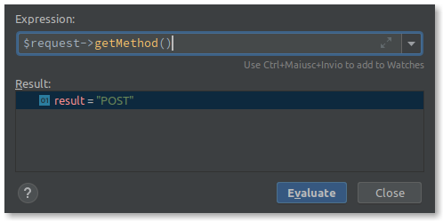
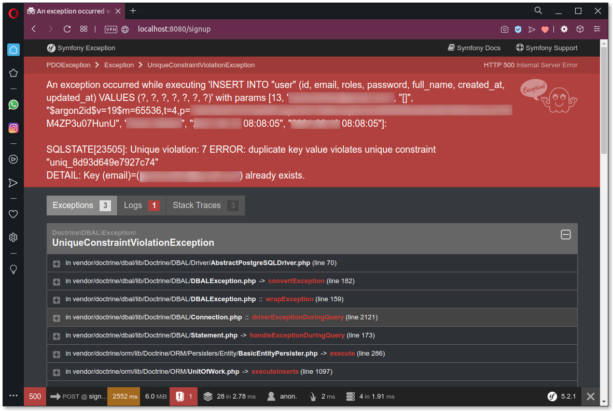

=== Logica di registrazione

Il form di registrazione si apre così:

[source,html]
----
<form id="sign_up" method="POST">
----

In mancanza dell'attributo `action` del tag `form`, il browser fa sì che i dati vengano inviati allo *stesso URL* a cui viene servito il form: in altre parole, quando viene cliccato il pulsante di _submit_ (Sign up), i dati inseriti verranno postati all'URL a cui ci troviamo (in questo caso, `/signup`). +
Finora la nostra azione ignora bellamente i dati ricevuti; come possiamo distinguere se stiamo renderizzando il form o abbiamo ricevuto dei dati dallo stesso? Occorre stabilire con quale metodo HTTP "siamo stati chiamati": per capire come fare, possiamo attivare il debugger, impostare un breakpoint alla prima riga dell'azione *signup()*, e quando il breakpoint viene raggiunto, far valutare l'espressione *$request->getMethod()* al nostro IDE. +
Se abbiamo inviato il form compilato, il metodo HTTP -e il risultato di questa espressione- sarà *POST*; in caso contrario il metodo sarà *GET* (quello usato di default dai browser).

Ora che sappiamo controllare se stiamo ricevendo dati da un form compilato, possiamo utilizzare i dati ricevuti per creare una Entity di tipo *User*.
Se non si trattasse di una Entity associata ad un account utente, ci basterebbe copiare i campi del form (`email`, `full_name` e `password`) nei loro omonimi in una istanza di *User*; in questo caso invece, la password non può essere salvata in chiaro ma deve essere criptata, altrimenty Symfony non riuscirà ad autenticare gli utenti footnote:pw[In teoria è possibile salvare le password in chiaro, utilizzando `plaintext` come metodo di codifica. Tuttavia, questo rappresenta un problema di sicurezza, in quanto chiunque acceda anche involontariamente alla tabella `users` potrebbe impossessarsi delle password e farne un uso scorretto.]. Per criptare la password ricevuta dal form, è necessario usare l'_encoder_ specificato nel file di configurazione *guybrush/config/packages/security.yaml* alla voce *security.encoders.App\Entity\User.algorithm*.

[source, yaml]
.guybrush/config/packages/security.yaml
----
security:
    # ...
    encoders:
        # ...
        App\Entity\User:
            algorithm: auto
----

L'_encoder_ non è altro che una classe che implementa l'interfaccia *Symfony\Component\Security\Core\Encoder\UserPasswordEncoderInterface* (in particolare per criptare la password ne useremo il metodo *encodePassword(UserInterface $user, string $plainPassword)*). Come possiamo fare per ottenerne un'istanza? +
Ancora una volta ricorriamo all'_((Autowiring))_ che abbiamo incontrato con il comando di importazione massiva (al par. <<#comandi_e_db>>), e aggiungiamo un argomento di tipo *((UserPasswordEncoderInterface))* alla firma dell'azione. In tal modo, e _indipendentemente_ dal tipo di algoritmo di criptazione che abbiamo scelto, Symfony si occuperà di istanziare la classe corretta e passarla alla nostra azione.

[source, php]
.guybrush/src/Controller/SuperController.php
----
use Symfony\Component\Security\Core\Encoder\UserPasswordEncoderInterface;

class SuperController extends AbstractController
{
    // ...

    public function signup(
      Request $request,
      UserPasswordEncoderInterface $pwEncoder
    ): Response
    {
        // ...
    }
}
----

Ora siamo in grado di salvare la Entity perché possiamo impostarne tutti i campi. Per salvarla ci occorre l'Entity Manager di Doctrine, e a differenza di quanto fatto nei _Console Command_ - siccome ci troviamo in un Controller - per ottenerne un'istanza basta chiamare `$this->getDoctrine()->getManager();`. Siccome stiamo salvando una *nuova* Entity, bisogna ricordarsi di chiamare prima il metodo `persist()` e poi `flush()`; infine, portiamo l'utente alla pagina di login. Qualcosa del genere:

[source, php]
.Metodo signup(), prima stesura
----
public function signup(
    Request $request,
    UserPasswordEncoderInterface $pwEncoder
): Response {
    if ($request->getMethod() === 'POST') {
        
        $user = new User();
        $user
            ->setEmail($request->get('email'))
            ->setFullName($request->get('full_name'))
            ->setPassword($pwEncoder->encodePassword($user, $request->get('password')));

        $em = $this->getDoctrine()->getManager();
        $em->persist($user);
        $em->flush();
        return $this->redirectToRoute('login');
    }

    return $this->render('signup.html.twig', ['messages' => []]);
}
----

Proviamo a vedere se il form funziona? Dovrebbe, se non abbiamo fatto errori; inseriamo valori anche casuali ma coerenti nel form presente all'URL http://localhost:8080/signup , e premendo il pulsante *Sign up*  il sito ci porterà alla pagina di login: questo è il sintomo che non c'è stata nessuna _Exception_ e l'utenza è stata salvata nel database.

TIP: Nel form ci sono due campi password per controllare che l'utente non abbia fatto errori di digitazione. Il controllo dell'uguaglianza delle password viene effettuato - per ora - solo dal frontend (cioè dallo script */js/pages/examples/sign-up.js*).

<<<

== Resilienza

Per adesso il form salva i dati se li inseriamo correttamente. Se però si verifica un qualsiasi tipo di errore nel backend, la pagina `/signup` va in crash, cioè restituisce uno _status HTTP_ 500, e questo in generale non è ammissibile in un ambiente di produzione. Se da un lato non possiamo prevedere tutti i tipi di problemi che si possono verificare, d'altro canto l'utente ha il diritto di essere informato che si è verificato un problema, con un messaggio di errore appropriato. +
Vediamo subito uno dei problemi più frequenti: l'utilizzo di uno _username_ già esistente. Il form di _sign up_ che abbiamo scritto non fa altro che postare i dati a Symfony, senza verificare preventivamente l'esistenza dello username; in caso cerchiamo di inserire due volte lo stesso utente (cioè usiamo due volte la stessa *email* per registrarci)... beh, proviamo a vedere che succede: inseriamo gli stessi valori che abbiamo usato per registrarci poco fa, e otterremo questo:

Possiamo ovviare in diversi modi: se volessimo evitare a tutti i costi le _((Exception))_, potremmo creare un'azione per *controllare se un'email è già stata registrata* e chiamarla prima di fare il _submit_; oppure, come faremo, potremmo aggiungere alla nostra azione di _signup_ un costrutto *try-catch* che catturi questo tipo specifico di _Exception_, ossia *((UniqueConstraintViolationException))*. Il blocco *try* può partire dall'istruzione `flush()`, che esegue la query INSERT (che nel nostro caso genera l'_Exception_).

[source,php]
----
use Doctrine\DBAL\Exception\UniqueConstraintViolationException;

// ....

try {
    $em->flush();
    return $this->redirectToRoute('login');
} catch (UniqueConstraintViolationException) {
    // ... L'email richiesta esiste già:
    // informiamo l'utente dell'errore.
}
----

Il blocco `catch` è il luogo dove possiamo informare l'utente su cosa è andato storto. Un modo per farlo è utilizzare i _flash message_ di Symfony footnote:flash[La documentazione sui _flash message_ di Symfony è disponibile nel sito ufficiale: https://symfony.com/doc/current/components/http_foundation/sessions.html#flash-messages]. Nel template che abbiamo scritto e che stiamo usando, abbiamo già il codice necessario per mostrare eventuali messaggi:

[source,twig]
----

    
        

            {{ msg }}
        

    

----

Ci manca solo la parte di codice PHP che imposti i messaggi da visualizzare. Per aggiungere un messaggio _flash_ in Symfony è sufficiente chiamare questo metodo:

[source,php]
----
$session->getFlashBag()->add($message_type, $message_body);
----

Dove $session è un'istanza di *Symfony\Component\HttpFoundation\Session\Session* (possiamo ottenerla _gratis_ usando l'_((Autowiring))_ di Symfony). I due argomenti `$message_type` e `$message_body` rappresentano rispettivamente il tipo e il contenuto del messaggio che vogliamo mostrare all'utente, e il valore di `$message_type` è libero, nel senso che non deve avere un valore predefinito come _error_, _warning_ ecc.; il template assegna ai messaggi la classe CSS `alert-{{ type }}`, e `type` è proprio il valore di `$message_type`, quindi i valori utili per `$message_type` -se non modifichiamo il foglio di stile- saranno:

- *success*: verde
- *info*: azzurro
- *warning*: giallo
- *danger*: rosso

Nel caso dell'errore che stiamo gestendo, è opportuno assegnare al messaggio una tipologia `warning` o `danger` (io ho scelto quest'ultimo perché le avevo associato un'animazione diversa). +
Affinché il messaggio che aggiungiamo venga visualizzato, va modificato l'argomento della chiamata a *render()*: dovremo infatti passargli come variabile `messages` i messaggi presenti nella _flash bag_ di Symfony. Se non ne aggiungiamo nessuno, `messages` sarà un array vuoto come prima.

[source,php]
.Passiamo al template i messaggi flash
----
return $this->render('signup.html.twig', ['messages' => $session->getFlashBag()->all()]);
----

A questo punto, l'azione `signup()` gestisce *un tipo* di Exception (quella legata ai tentativi di registrazioni multiple), ma per qualsiasi altro tipo restituirà un errore HTTP 500. footnote:exception[Quando il blocco `catch` ha come argomento una specifica tipologia di _Exception_, tutte le altre tipologie non verranno _catturate_.] Per gestire in modo analogo tutti gli altri tipi di _Exception_, possiamo aggiungere *un altro* blocco `catch` dopo il primo, che catturi il tipo generico `\Exception` cioè la classe base di tutte le _Exception_, come nell'esempio che segue.

[source,php]
.Catturiamo tutti i tipi di Exception
----
try{
    // ...
} catch (UniqueConstraintViolationException) {
    // ...
} catch (\Exception $exception) {
    $session->getFlashBag()->add(
        'danger',
        'Cannot save: '.$exception->getMessage()
    );
}
----

Per finire, impostiamo un flash message anche in caso di successo, dimodoché l'utente sappia che la registrazione ha avuto esito positivo. Per visualizzare il messaggio sarà necessario modificare anche l'azione *login()* come segue:

[source,php]
----
public function login(Session $session): Response
{
    return $this->render('login.html.twig', ['messages' => $session->getFlashBag()->all()]);
}
----
