[appendix]
= Symfony e Windows Server(TM)

****
In questo capitolo vedremo come far funzionare un sito Symfony su macchine Windows Server (((Windows,Windows Server))) con web server Microsoft (R) _Internet Information Services_ (((IIS))).

.Disclaimer
Non sono affiliato, associato né collaboratore di ((Microsoft)); inoltre, con queste indicazioni non intendo sponsorizzare alcun prodotto Microsoft.
****

== Powershell

Possiamo usare ((Powershell)) in totale tranquillità perché non crea problemi di funzionamento con Composer e PHP, e anche perché il sito verrà servito dalla macchina Windows e non da una VM Linux.

== PHP

[NOTE]
.Come verificare se PHP è installato
====
Apriamo una finestra di Powershell e digitiamo:

  php -v

se l'output del comando non è un errore (evidenziato in rosso), ma somiglia a quanto sotto, PHP è già installato e funzionante e possiamo passare alla <<cgirole,verifica del ruolo CGI in IIS>>; altrimenti seguiamo le istruzioni seguenti.

----
PHP 7.2.13 (cli) (built: Dec  5 2018 07:19:53) ( NTS MSVC15 (Visual C++ 2017) x64 )
Copyright (c) 1997-2018 The PHP Group
Zend Engine v3.2.0, Copyright (c) 1998-2018 Zend Technologies
----

====

=== Installare PHP

Per Windows, i file binari di PHP vengono distribuiti in due versioni: _thread safe_ e _non-thread safe_. Per far funzionare PHP con IIS è necessaria la versione *non-thread safe*, che possiamo scaricare dal <<php_windows,sito di PHP per Windows>>.

Scegliamo una versione di PHP che sia __non thread safe__ e compatibile con la CPU e il sistema operativo del nostro server: x64 se abbiamo una macchina a 64 bit, x86 in caso contrario. Nel dubbio, **la versione x86 funziona su entrambe le architetture**.

=== Modifica del PATH

Scompattiamo il file zip dove vogliamo, ad es. nella radice del disco di sistema (tipicamente **C:\**). Una volta scompattato, bisogna aggiungere la directory contenente i file *php.exe* e *php-cgi.exe* al PATH: in tal modo PHP sarà accessibile digitando `php` da Powershell.

=== php.ini

Copiamo il file *php.ini.dist* nella stessa directory dandogli il nome di **php.ini**: per default PHP userà questo file.

[#cgirole]
== Ruolo CGI

Per utilizzare PHP con IIS, è necessario il ruolo CGI (che potrebbe non essere installato).

[NOTE]
.Come verificare se il ruolo CGI è installato
====
. In IIS Manager selezioniamo il nostro server nella barra laterale sinistra.
. Se compare l'icona  il ruolo è installato; altrimenti, seguiamo le istruzioni qui di seguito.

====

=== Installazione del ruolo CGI in Windows Server 2012 e successivi

. Lanciamo l'applicazione _Server Manager_. 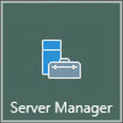

. Nel menu _Manage_ (in alto a destra), selezioniamo _Add Roles and Features_.
+
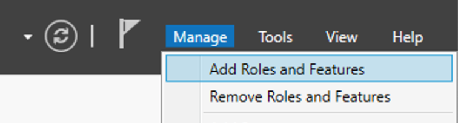

. Nella finestra che si aprirà, clicchiamo _Next_. Selezioniamo il tipo di installazione e clicchiamo _Next_. Selezioniamo poi il server di destinazione e clicchiamo nuovamente _Next_.
. Nella pagina _Server Roles_, apriamo la sezione **Web Server (IIS)** > **Web Server** > **Application Development**, e quindi spuntiamo _CGI_, dopodiché clicchiamo _Next_.
. Nella pagina _Select Features_ clicchiamo _Next_.
. Nella pagina _Confirm installation selections_, clicchiamo _Install_.
. Nella pagina _Results_, clicchiamo _Close_.

=== Installazione del ruolo CGI in altre versioni di Windows

Se stiamo usando un'altra versione di Windows, possiamo trovare le istruzioni di installazione nel
https://docs.microsoft.com/en-us/iis/configuration/system.webserver/fastcgi/application/environmentvariables/#setup[sito di Microsoft].

== Come far rileggere php.ini ad IIS

Di default, IIS non rilegge il file *php.ini* quando lo modifichiamo, ma solo all'avvio del servizio; per fargli recepire le modifiche, quindi, è necessario riavviare il servizio IIS. Questo comportamento può essere modificato come segue.

. In IIS Manager, selezioniamo il server nella barra laterale.
. Facciamo doppio click sull'icona _FastCGI Settings_:
+
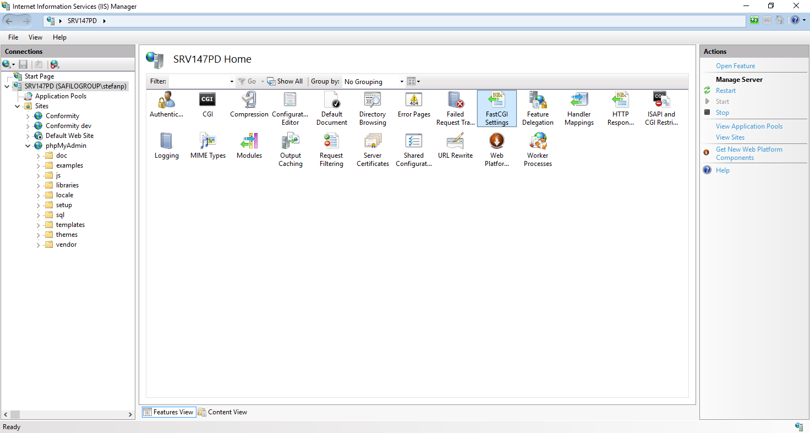

. Se non è ancora presente, creiamo una nuova applicazione cliccando su *Add application...* sulla destra, e specifichiamo come _Full Path_ il percorso dell'eseguibile *php-cgi.exe*. Tutti gli altri default vanno bene.

. Alla voce "Monitor changes to file", specifichiamo il percorso del nostro file *php.ini*. 
+
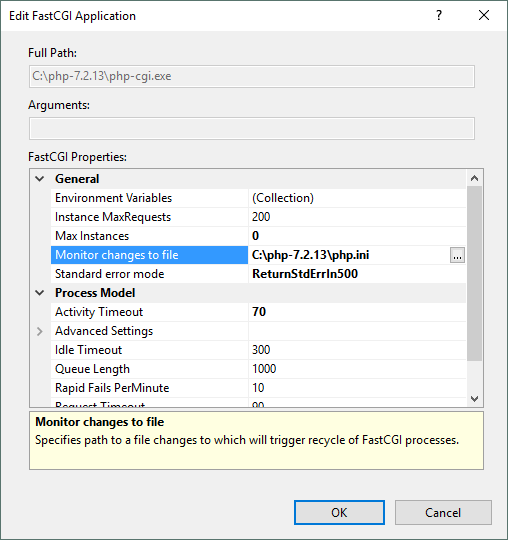

== URL rewrite

Symfony ha bisogno di un webserver che supporti l'_URL rewriting_. Per IIS, questa caratteristica è disponibile solo sotto forma di *modulo aggiuntivo* (non è incluso in IIS di default), e potrebbe non essere presente nel nostro server.

[NOTE]
.Come verificare se il modulo URL rewrite è installato
====
. In IIS Manager, selezioniamo il nostro server nella barra laterale sinistra.
. Se compare l'icona 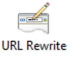 il modulo è già installato. 

====

Per installare questo modulo è necessario scaricarlo dal https://www.iis.net/downloads/microsoft/url-rewrite[sito di Microsoft]. +
Alla fine dell'installazione, riavviamo IIS Manager per veder comparire la relativa icona. 

== Failed request tracing rules

In IIS di default non è attivato il _logging_ delle pagine che generano errori, ossia codici HTTP dal 400 in su. Io suggerisco di attivare questa funzionalità, perché può essere determinante in fase di debug e risoluzione dei problemi.

[NOTE]
.Come verificare se le Failed Request Tracing Rules sono installate
====
. In IIS Manager, selezioniamo il nostro server nella barra laterale sinistra.
. Se compare l'icona 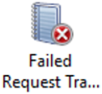 il ruolo è installato; altrimenti, seguiamo le istruzioni.

====

. Lanciamo l'applicazione _Server Manager_. 

. Nel menu _Manage_ (in alto a destra), selezioniamo _Add Roles and Features_.
+

. Nella finestra che si aprirà, clicchiamo _Next_. Selezioniamo il tipo di installazione e clicchiamo _Next_. Selezioniamo poi il server di destinazione e clicchiamo nuovamente _Next_.
. Nella pagina _Server Roles_, apriamo la sezione **Web Server (IIS)** > **Web Server** > **Health and Diagnostics**, e quindi spuntiamo _Tracing_, dopodiché clicchiamo _Next_.
+
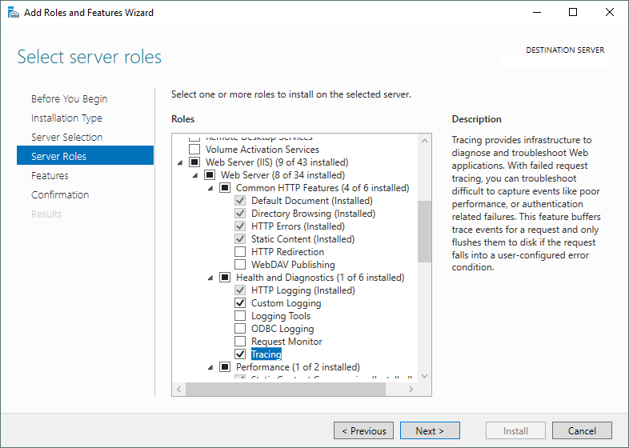

. Nella pagina _Select Features_ clicchiamo _Next_.
. Nella pagina _Confirm installation selections_, clicchiamo _Install_.
. Nella pagina _Results_, clicchiamo _Close_.
. Apriamo _IIS Manager_ (se era già aperto, chiudiamolo e rilanciamolo per fargli rileggere tutti i moduli). Selezioniamo il nostro sito nell'albero a sinistra, e ora dovrebbe comparire anche l'icona *Failed Request tracing rules*. Facciamo doppio click sull'icona, e clicchiamo sull'avviso che dovrebbe comparire sul lato destro della finestra:
+
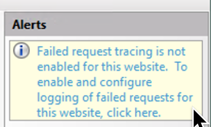

[#installazione_composer]
== Composer

[NOTE]
.Come verificare se Composer è installato
====
Apriamo una finestra di Powershell e digitiamo:

  composer -V

se l'output del comando non è un errore (rosso) ma somiglia a quanto sotto, Composer è già installato e funzionante.

----
Composer version 1.8.0 2018-12-03 10:31:16
----

====

Installare ((Composer)) in ambiente Windows può essere frustrante se si seguono le indicazioni ufficiali. Un metodo che funziona di sicuro è:

- scaricare manualmente la versione più recente dalla pagina  https://getcomposer.org/download/[download] del sito ufficiale di Composer, salvandola dove vogliamo, ad esempio nella directory di PHP (qualcosa come `C:\php\composer.phar`);

- creare un file `composer.bat` in una directory nel PATH di Windows (ad es. in C:\ nella directory di PHP, con il seguente contenuto:
+
[source,bat]
----
php <percorso_di_salvataggio>\composer.phar %*
----

TIP: Il carattere *%* seguito dall'asterisco (`%\*`) nei file *.bat* significa "il resto della linea comando": in questo caso serve a passare tutti gli argomenti con cui chiamiamo il file *.bat* a composer.phar.

(((MariaDB)))

== MariaDB

Se il nostro progetto Symfony utilizza un database (come nel caso di questo corso), abbiamo diverse scelte a disposizione: una fra le più rapide, gratuita, è usare <<mariadb,MariaDB>>, un fork gratuito e open source di ((MySQL)).

TIP: Per usare MariaDB con PHP *non è necessaria* alcuna estensione aggiuntiva: si possono usare le estensioni *mysqli* e *pdo_mysql*, incluse nell'installazione standard di PHP.

=== Servizio

Se abbiamo scaricato l'archivio in formato zip, possiamo configurare MariaDB come _servizio_ di Windows usando il comando *mysql_install_db.exe*, come segue. 

. Scompattiamo lo zip dove vogliamo. 
. Apriamo Powershell come Administrator.
. Posizioniamoci nella sottocartella *\bin* della cartella in cui abbiamo scompattato MariaDB:
+
[source,Powershell]
----
pushd <percorso_di_mariadb>\bin
----

. Diamo il comando _mysql_install_db.exe_ con le opzioni:

  * *datadir*: directory in cui MariaDB scriverà i database: generalmente è la sottodirectory *data\* della cartella di installazione di MariaDB. *Nota*: il percorso va scritto _per esteso_, ad es. *C:\MariaDB\data*;
 
  * *service*: nome del servizio MariaDB;
  * *password*: password che desideriamo impostare per l'utente *root* (l'utente principale dell'istanza di database).
+
[source,Powershell]
----
.\mysql_install_db.exe \
--datadir=<percorso_di_mariadb>\data \
--service=MariaDB \
--password=<pw_di_root>
----

A questo punto, nella finestra dell'applicazione `services.msc` comparirà un nuovo servizio di nome *MariaDB*.

== Creazione del progetto Symfony

Da Powershell possiamo creare un progetto (ad es. dentro `%SYSTEMDRIVE%\inetpub\`) con i comandi:

[source,Powershell]
----
> pushd $env:SystemDrive\inetpub
> composer create-project symfony/website-skeleton myproject
----

TIP: Nel comando qui sopra, possiamo sostituire *myproject* con il nome del nostro progetto Symfony.

== Permessi sulla directory var

Di default la directory *var* del progetto Symfony non è scrivibile da parte di IIS; finché Symfony non riesce a creare e modificare file in questa directory, il sito non funzionerà. Per renderla scrivibile, bisogna dare il permesso _Write_ al gruppo locale *Users*, come segue.

. Da **Esplora risorse**, clicchiamo col destro sulla directory `var` e selezioniamo *Properties*.
. Nella finestra che si apre, al tab _Security_, selezioniamo _Edit..._
. selezioniamo l'utente *Nomeserver\Users* (_Nomeserver_ è il nome del server che stiamo configurando).
. Mettiamo la spunta sui permessi *Modify* e *Write* (importante: vanno messe nella colonna *Allow*) e clicchiamo Ok.
. Clicchiamo Ok anche nella finestra _Properties_ per chiuderla e confermare le modifiche.

WARNING: È importante selezionare ambedue i permessi, *Modify* e *Write*. Se diamo ad es. solo il permesso _Write_, Symfony potrà creare nuovi file ma *non avrà il permesso di rinominarli*: alla prima modifica dei sorgenti quindi non riuscirà a rinfrescare la cache generando un _Server Error_ (HTTP 500).

== Creazione del sito in IIS

In IIS possiamo creare il nuovo sito selezionando _'Add website...'_. Specifichiamo come DocumentRoot la sottocartella *public* della cartella *myproject* .

[#frtr-attivazione]
=== Attivazione del logging

Creiamo una regola di tracciamento, altrimenti il modulo *Failed Request tracing rules* -seppur presente, non verrà utilizzato. 

. Facciamo doppio click sull'icona corrispondente -  - e poi clicchiamo su *Add...* (sulla destra):

. Lasciamo spuntato _All content_ nella prima sezione (__What would you like to trace?__) e clicchiamo _Next_
+
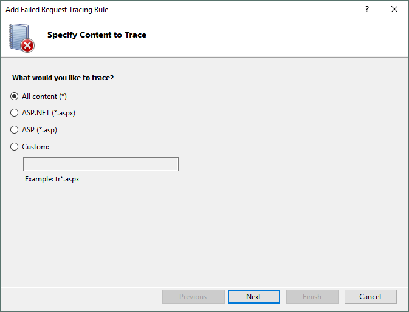

. Lasciamo spuntato _Status code(s)_ nella seconda sezione (__Under which condition(s) should a request be traced?__), inseriamo *400-999* nel campo di testo.

+
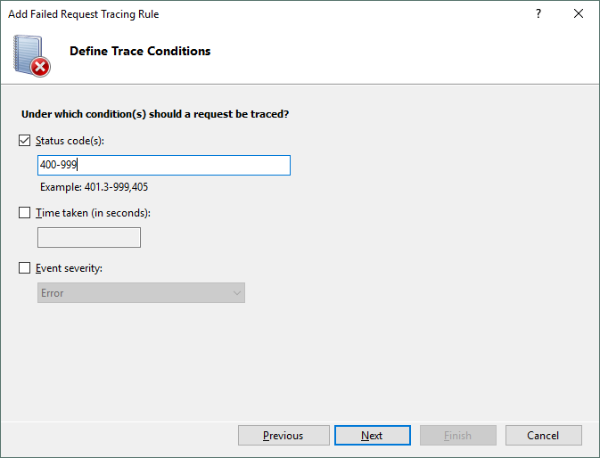

. Clicchiamo su _Next_ e quindi su _Finish_ per attivare il tracciamento.

. Se in un secondo momento vorremo cambiare la directory in cui vengono salvati i log, possiamo cliccare su *Edit Site Tracing...* (il valore di default è *%SystemDrive%\inetpub\logs\FailedReqLogFiles*).
+
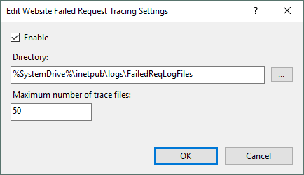

=== Usiamo PHP: _Handler mappings_

. Facciamo doppio click sull'icona *Handler mappings*  e poi clicchiamo su *Add Module Mappings...* (sulla destra).

. Nella finestra che si aprirà inseriamo i valori seguenti.
+
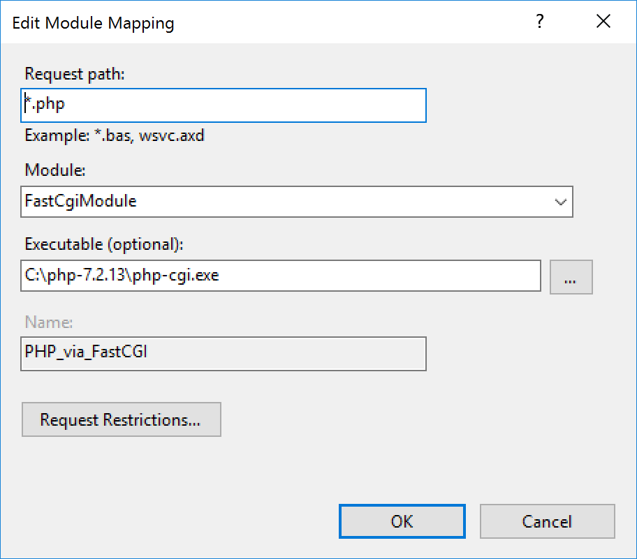

. Per sicurezza, specifichiamo che le richieste devono essere processate anche se si riferiscono a directory: clicchiamo su _Request Restrictions..._, e nella finestra che si apre selezioniamo _File or folder__.
+
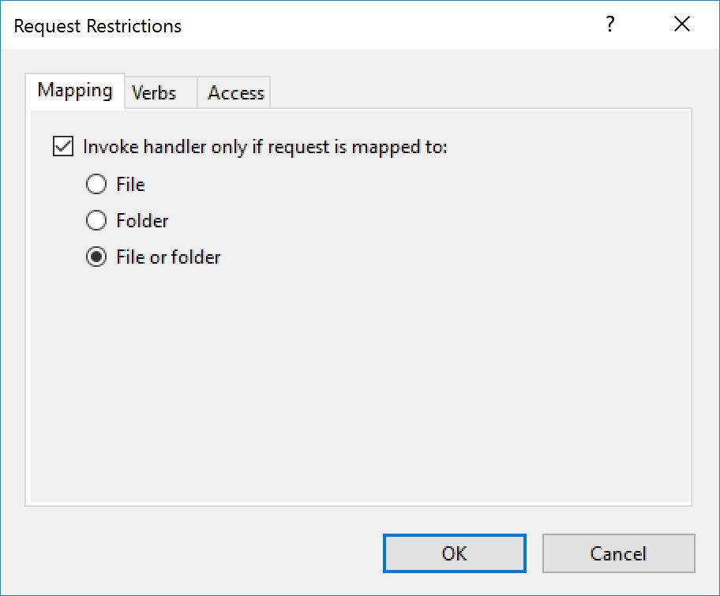

. Clicchiamo su _OK_ per salvare le modifiche.

== web.config

Al momento Symfony non ha un file `web.config` preconfezionato. Qui sotto ce n'è uno di funzionante: le sezioni *defaultDocument* e *rewrite* servono rispettivamente per:

* specificare che quando viene richiesta una directory (ad es. "/"), va servito il file *index.php* anziché il default di IIS;
* specificare le regole di _URL rewriting_ necessarie per Symfony.

[source,xml]
----
<?xml version="1.0" encoding="UTF-8"?>
<configuration>
  <system.webServer>
    <defaultDocument>
      <files>
        <remove value="iisstart.htm" />
        <remove value="Default.htm" />
        <remove value="Default.asp" />
        <add value="index.php" />
      </files>
    </defaultDocument>
    <rewrite>
      <rules>
        <rule name="Redirect index.php/anything to /anything" stopProcessing="true">
          <match url="^index\.php(/(.*)|$)" ignoreCase="false" />
          <action type="Redirect" url="/{R:2}" redirectType="Permanent" />
        </rule>
        <rule name="Existing files" stopProcessing="true">
          <match url=".?" ignoreCase="false" />
          <conditions logicalGrouping="MatchAll">
            <add input="{REQUEST_FILENAME}" matchType="IsFile" ignoreCase="false" />
          </conditions>
          <action type="None" />
        </rule>
        <rule name="All the rest to index.php" stopProcessing="true">
          <match url=".?" ignoreCase="false" />
          <action type="Rewrite" url="/index.php" />
        </rule>
      </rules>
    </rewrite>
  </system.webServer>
</configuration>
----

#@todo# spiegare le sezioni rewrite/rules/rule

== Variabili d'ambiente (environment vars)

In ambiente di sviluppo, Symfony usa il file *((.env))* (nella directory radice del progetto) per memorizzare le variabili d'ambiente come ad es. le credenziali di connessione al database. In ambiente di produzione, abbiamo due scelte:

. utilizzare il file *.env* per le voci di configurazione comuni all'ambiente di sviluppo e produzione, e un ulteriore file *.env.local* (che non verrà _committato_ nel repository Git), contenente le voci di configurazione "locali", cioè quelle relative alla *macchina* su cui viene caricato. Tecnicamente  *.env.local* fa l'override di *.env*;

. utilizzare le variabili d'ambiente (_environment variables_) del webserver, e *nessun file .env* (sconsiglio di usare questa soluzione, e capiremo perché tra breve).

.Come impostare le variabili d'ambiente in IIS

Per impostare variabili d'ambiente in IIS, bisogna effettuare diverse operazioni (fra cui *modificare il registro di Windows*): +

. In IIS, creare un AppPool #@todo#
. impostarlo su _AlwaysRunning_ (il default è _OnDemand_)
. capire qual è il suo *SID* aprendo RegEdit (#@todo# spiega meglio)
. impostare la voce `HKEY_Users\<SID>\Environment\<NomeDellaVariabile>` come mostrato in figura:
+
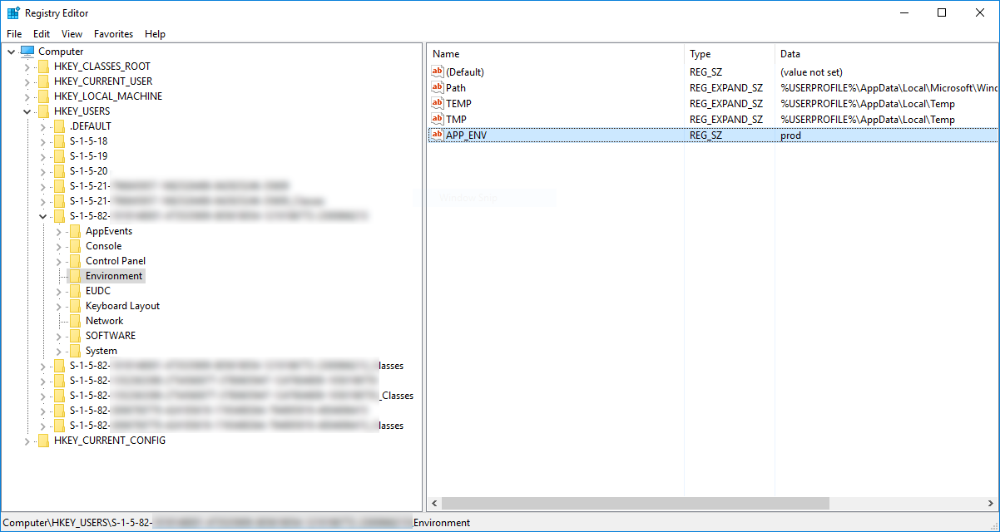

. Affinché le modifiche siano operative, va riavviato l'*Application Pool* oppure il _servizio_ IIS; riavviare solo il sito non farà rileggere le variabili d'ambiente ad IIS.

.Ulteriori riferimenti

La semplicità di Apache è molto lontana...

https://serverfault.com/q/711470/

https://serverfault.com/q/397966/

=== Virtual directory

Se vogliamo far girare Symfony in una _((Virtual directory))_ o comunque non nella radice del sito (cioè con un prefisso, ad es. www.example.com/*mysite*/), sarà necessario specificare il prefisso tramite la voce di configurazione **parameters.router.request_context.base_url**. Possiamo farlo aggiungendo la seguente riga alla voce *parameters:* del file *config/services.yaml*:

[source,yaml]
----
parameters:
  # ...
  router.request_context.base_url: 'mysite/'
----
